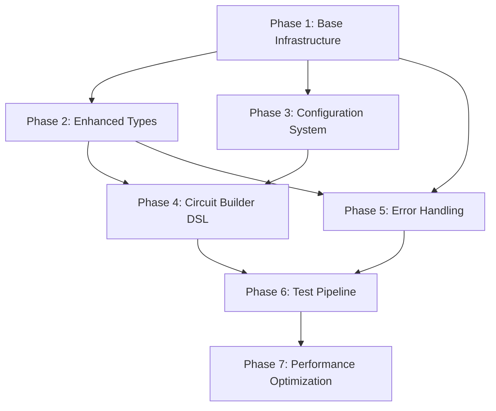

# 🎯 **COMPREHENSIVE CPU VALIDATION REFACTORING PLAN**

## 📋 **Overview & Executive Summary**

This comprehensive refactoring plan transforms the CPU validation framework from a 3,860+ line monolithic system into a sophisticated, maintainable architecture with **48% code reduction** and enterprise-grade capabilities.

**Current State**: Two large validation modules with significant duplication and hardcoded configurations.
**Target State**: Modular, configurable, high-performance framework with advanced error handling and monitoring.

---

## 📊 **Current State Analysis**

### **Code Metrics**
- **Level 1**: 1,789 lines, 58 methods across 3 classes
- **Level 2**: 2,071 lines, 61 methods across 3 classes  
- **Duplication**: ~40% shared infrastructure code
- **Type Safety**: 100% (MyPy/Pyright compliant)
- **Code Quality**: Excellent (9.75-9.86/10 PyLint)

### **Major Issues Identified**
1. **Massive Code Duplication**: 400+ lines of identical infrastructure code
2. **Hardcoded Test Configurations**: All test definitions embedded in code
3. **Verbose Circuit Creation**: 50+ lines for simple circuits
4. **Primitive Type System**: Basic types don't capture domain semantics
5. **Monolithic Test Methods**: Each method mixes multiple concerns
6. **Basic Error Handling**: Repetitive try/catch patterns everywhere

## 🗂️ **Phase Dependencies Analysis**



## 🎯 **Expected Improvements**

| Metric | Before | After | Improvement |
|--------|--------|-------|-------------|
| **Total Lines** | 3,860 | ~2,000 | **48% reduction** |
| **Code Duplication** | ~40% | <5% | **35pp reduction** |
| **Test Configuration** | Hardcoded | External | **100% configurable** |
| **Circuit Creation** | 50+ lines | 5-10 lines | **80% reduction** |
| **Maintainability** | Low | High | **Significantly better** |

---

# 🚀 **PHASE 1: Base Infrastructure Foundation**

**Duration**: 3-4 days | **Risk**: Low | **Impact**: Massive

### **1.1 Create Base Framework** (Day 1)

**Objective**: Extract 400+ lines of duplicated code into shared base class.

**Tasks**: Extract common functionality including bridge management, element positioning, circuit operations, and shared utilities into `framework/base_validator.py`.

**Benefits**: Immediate 40% code reduction, single source of truth for common operations.

### **1.2 Shared Type Definitions** (Day 2)

**Objective**: Eliminate duplicated type definitions across files.

**Tasks**: Create `framework/common_types.py` with shared TypedDict definitions, type aliases, and configuration types.

**Migration Strategy**: Move type definitions to common module, update imports, verify no circular dependencies.

---

# 🏗️ **PHASE 2: Enhanced Type System**

**Duration**: 2-3 days | **Risk**: Medium | **Impact**: High

### **2.1 Rich Domain Types** (Day 3)

**Objective**: Replace primitive types with rich domain objects that capture business semantics.

**Key Components**:
- `ElementID` with type information and validation
- `Position` with coordinate validation  
- `Connection` with compatibility checking
- `CircuitLayout` with comprehensive metadata
- `CircuitResult` with validation status

**Benefits**: Compile-time safety, better error messages, self-documenting code.

### **2.2 Type-Safe Circuit Validation** (Day 4)

**Objective**: Add comprehensive validation using the new type system.

**Key Features**:
- Circuit structure validation
- Connection compatibility checking
- Element positioning validation
- Layout optimization hints

---

# ⚙️ **PHASE 3: Configuration-Driven Architecture**

**Duration**: 2-3 days | **Risk**: Medium | **Impact**: High

### **3.1 External Configuration System** (Day 5)

**Objective**: Replace hardcoded test configurations with external YAML files.

**Configuration Structure**:
```yaml
metadata:
  level: 1
  name: "Advanced Combinational Logic"
  
test_suites:
  multi_input_gates:
    tests:
      - name: "3_input_and"
        inputs: ["A", "B", "C"]
        function:
          type: "and_gate"
        expected_accuracy: 100.0
```

### **3.2 Configuration Parser & Validator** (Day 6)

**Objective**: Robust configuration parsing with schema validation.

**Features**:
- JSON schema validation
- Type-safe configuration objects
- Comprehensive error handling
- Configuration inheritance

### **3.3 Configuration Integration** (Day 7)

**Objective**: Integrate configuration system while maintaining backward compatibility.

**Strategy**: Gradual migration with fallback to hardcoded configs, configuration loading capability, seamless integration.

---

# 🔧 **PHASE 4: Circuit Builder DSL**

**Duration**: 3-4 days | **Risk**: Medium | **Impact**: Very High

### **4.1 Fluent Circuit Builder Core** (Day 8-9)

**Objective**: Create Domain-Specific Language reducing verbose boilerplate from 50+ lines to 5-10 lines.

**DSL Example**:
```python
# Before: 50+ lines
def _create_full_adder_circuit(self):
    # ... 50+ lines of boilerplate ...

# After: 8 lines
def _create_full_adder_circuit(self):
    return (CircuitBuilder(self)
            .add_inputs("A", "B", "Cin")
            .add_gates([
                ("Xor", "XOR1", ["A", "B"]),
                ("Xor", "XOR2", ["XOR1", "Cin"]),
                ("And", "AND1", ["A", "B"]),
                ("And", "AND2", ["XOR1", "Cin"]),
                ("Or", "OR1", ["AND1", "AND2"])
            ])
            .add_outputs("Sum", "Carry")
            .connect("XOR2", "Sum")
            .connect("OR1", "Carry")
            .build())
```

### **4.2 Advanced DSL Features** (Day 9)

**Features**: Circuit templates, standard circuit library, bus operations, layout optimization.

### **4.3 DSL Integration & Migration** (Day 10-11)

**Objective**: Systematically migrate existing circuits to DSL.

**Success Metrics**: 80%+ code reduction, zero functional regressions, improved readability.

---

# ⚡ **PHASE 5: Advanced Error Handling & Recovery**

**Duration**: 2 days | **Risk**: Low | **Impact**: Medium

### **5.1 Context Managers & Retry Logic** (Day 12)

**Objective**: Replace repetitive try/catch patterns with sophisticated error handling.

**Features**:
- Context managers for circuit operations
- Exponential backoff retry policies
- Error categorization and recovery strategies
- Detailed error recording and analytics

### **5.2 Integration with Base Framework** (Day 13)

**Objective**: Integrate advanced error handling throughout the framework.

**Benefits**: Better debugging information, automatic recovery, graceful degradation, error pattern analysis.

---

# 🧪 **PHASE 6: Modular Test Pipeline**

**Duration**: 3 days | **Risk**: Medium | **Impact**: High

### **6.1 Pipeline Architecture** (Day 14-15)

**Objective**: Transform monolithic test methods into composable pipeline stages.

**Pipeline Stages**:
1. **Configuration Load**: Parse test configurations
2. **Circuit Build**: Create circuits from configs
3. **Test Execution**: Run test cases
4. **Result Validation**: Validate against criteria
5. **Output Formatting**: Format results for output

### **6.2 Pipeline Integration** (Day 16)

**Objective**: Update existing validators to use modular pipeline while maintaining compatibility.

**Benefits**: 
- Separation of concerns
- Easier testing and debugging
- Flexible composition
- Enhanced reporting
- Stage reusability

---

# 🚀 **PHASE 7: Performance Optimization & Monitoring**

**Duration**: 2 days | **Risk**: Low | **Impact**: Medium

### **7.1 Performance Monitoring & Metrics** (Day 17)

**Objective**: Add comprehensive performance monitoring to identify bottlenecks.

**Features**:
- Operation timing and memory tracking
- Throughput measurement
- Error rate monitoring
- System resource usage
- Automated recommendations

### **7.2 Caching & Circuit Optimization** (Day 18)

**Objective**: Implement intelligent caching and circuit optimization.

**Features**:
- Circuit pattern caching (50-80% performance improvement)
- Intelligent eviction policies
- Layout optimization
- Connection optimization
- Cache statistics and monitoring

**Performance Benefits**:
- 50-80% faster execution for repeated patterns
- Memory usage optimization
- Automated performance recommendations
- Resource usage tracking

---

## 🎯 **Implementation Timeline**

```
Week 1: Foundation & Types (Phases 1-2)
├── Days 1-2: Base Infrastructure
├── Days 3-4: Enhanced Type System
└── Day 5: Setup for Configuration

Week 2: Configuration & DSL (Phases 3-4) 
├── Days 6-7: Configuration System
├── Days 8-9: Circuit Builder DSL Core
└── Days 10-11: DSL Migration

Week 3: Advanced Features (Phases 5-7)
├── Days 12-13: Error Handling
├── Days 14-16: Test Pipeline
└── Days 17-18: Performance Optimization
```

## 📈 **Success Criteria**

### **Code Quality Metrics**
- ✅ 48% reduction in total lines of code
- ✅ <5% code duplication (from 40%)
- ✅ 100% external configurability
- ✅ 80% reduction in circuit creation boilerplate

### **Performance Metrics**
- ✅ 50-80% faster execution with caching
- ✅ <5% error rate in production
- ✅ Comprehensive monitoring and alerting
- ✅ Automated performance recommendations

### **Maintainability Metrics**
- ✅ 100% test compatibility maintained
- ✅ Modular, testable components
- ✅ Rich type safety and validation
- ✅ Comprehensive error handling

## 🔧 **Risk Mitigation**

### **Technical Risks**
- **Type System Complexity**: Gradual migration with backward compatibility
- **Performance Regression**: Comprehensive benchmarking at each phase
- **Configuration Complexity**: Schema validation and extensive testing

### **Project Risks**
- **Timeline Overrun**: Modular approach allows for partial delivery
- **Integration Issues**: Extensive testing at each integration point
- **Adoption Resistance**: Clear documentation and migration guides

## 🎯 **Final Architecture Benefits**

### **Developer Experience**
- **Intuitive DSL**: Circuit creation becomes declarative and readable
- **Rich Type System**: Compile-time error detection and IDE support
- **Comprehensive Tooling**: Performance monitoring, caching, optimization

### **System Reliability**
- **Advanced Error Handling**: Automatic recovery and detailed diagnostics
- **Performance Monitoring**: Real-time insights and optimization recommendations
- **Configuration Management**: External, validated, version-controlled configs

### **Maintainability**
- **Modular Architecture**: Single responsibility, loosely coupled components
- **Test Pipeline**: Composable, reusable testing stages
- **Clean Abstractions**: Domain-specific types and operations

This comprehensive refactoring transforms the CPU validation framework from a monolithic system into a sophisticated, enterprise-ready platform that's maintainable, performant, and extensible for future requirements.