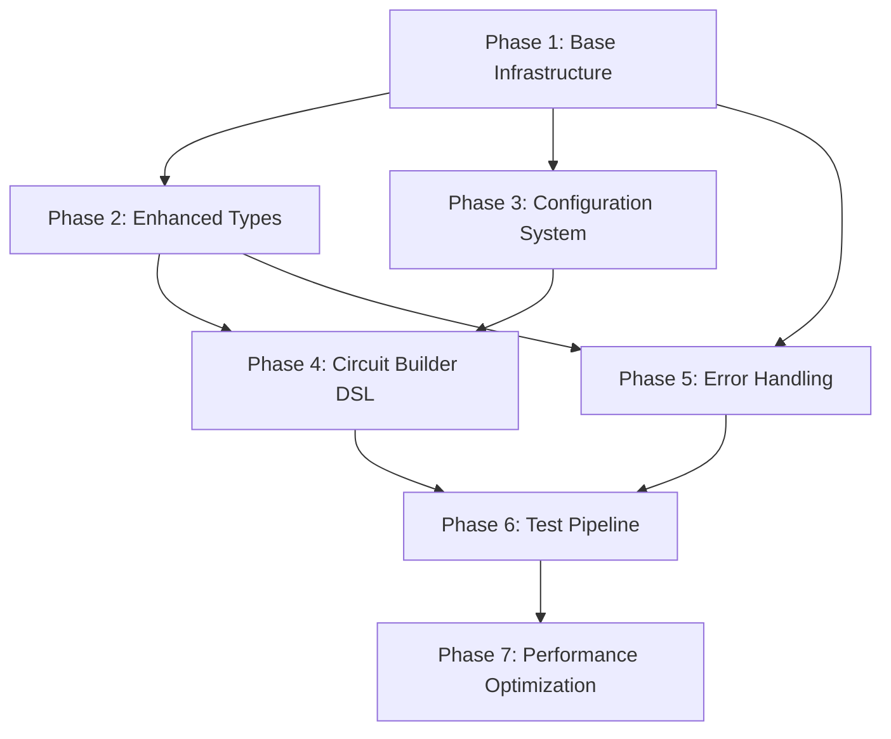

# 🎯 **Comprehensive CPU Validation Refactoring Plan**

## 📋 **Overview & Strategy**

**Approach**: Incremental refactoring with continuous validation to maintain 100% test compatibility throughout the process.

**Risk Mitigation**: Each phase includes rollback checkpoints and comprehensive testing before proceeding.

## 📊 **Current State Analysis**

### **Code Metrics**
- **Level 1**: 1,789 lines, 58 methods across 3 classes
- **Level 2**: 2,071 lines, 61 methods across 3 classes  
- **Duplication**: ~40% shared infrastructure code
- **Type Safety**: 100% (MyPy/Pyright compliant)
- **Code Quality**: Excellent (9.75-9.86/10 PyLint)

### **Major Issues Identified**
1. **Massive Code Duplication**: 400+ lines of identical infrastructure code
2. **Hardcoded Test Configurations**: All test definitions embedded in code
3. **Verbose Circuit Creation**: 50+ lines for simple circuits
4. **Primitive Type System**: Basic types don't capture domain semantics
5. **Monolithic Test Methods**: Each method mixes multiple concerns
6. **Basic Error Handling**: Repetitive try/catch patterns everywhere

## 🗂️ **Phase Dependencies Analysis**



## 🎯 **Expected Improvements**

| Metric | Before | After | Improvement |
|--------|--------|-------|-------------|
| **Total Lines** | 3,860 | ~2,000 | **48% reduction** |
| **Code Duplication** | ~40% | <5% | **35pp reduction** |
| **Test Configuration** | Hardcoded | External | **100% configurable** |
| **Circuit Creation** | 50+ lines | 5-10 lines | **80% reduction** |
| **Maintainability** | Low | High | **Significantly better** |

## 🚀 **PHASE 1: Base Infrastructure Foundation**

**Duration**: 3-4 days | **Risk**: Low | **Impact**: Massive

### **1.1 Create Base Framework** (Day 1)

**Objective**: Extract 400+ lines of duplicated code into shared base class.

**Tasks**:
```python
# Create: framework/base_validator.py
class CPUValidationFramework:
    """Base validation framework with shared functionality."""
    
    def __init__(self, level_name: str, config: Optional[FrameworkConfig] = None) -> None:
        self.bridge: Optional[WiredPandaBridge] = None
        self.test_results: List[Dict[str, Any]] = []
        self.current_test: Optional[str] = None
        self.level_name = level_name
        
        # Layout constants for proper element positioning
        self.ELEMENT_WIDTH = 64
        self.ELEMENT_HEIGHT = 64
        self.LABEL_OFFSET = 64
        self.MIN_VERTICAL_SPACING = 130
        self.MIN_HORIZONTAL_SPACING = 150
        self.GRID_START_X = 80
        self.GRID_START_Y = 100

    def _ensure_bridge(self) -> None:
        """Ensure bridge is connected"""
        if not self.bridge:
            self.bridge = WiredPandaBridge()
            self.bridge.start()

    def _get_grid_position(self, col: int, row: int) -> Tuple[float, float]:
        """Get grid-based position with proper spacing for elements and labels."""
        x = float(self.GRID_START_X + col * self.MIN_HORIZONTAL_SPACING)
        y = float(self.GRID_START_Y + row * self.MIN_VERTICAL_SPACING)
        return x, y

    def _get_input_position(self, index: int) -> Tuple[float, float]:
        """Get position for input elements in a vertical stack."""
        return self._get_grid_position(0, index)

    def _get_output_position(self, col: int, row: int = 0) -> Tuple[float, float]:
        """Get position for output elements."""
        return self._get_grid_position(col, row)

    def create_new_circuit(self) -> bool:
        """Create a new circuit by starting the application."""
        try:
            self._ensure_bridge()
            assert self.bridge is not None  # Type narrowing
            self.bridge.new_circuit()
            return True
        except WiredPandaError:
            return False

    def save_circuit(self, file_path: str) -> bool:
        """Save the current circuit to a file."""
        try:
            self._ensure_bridge()
            assert self.bridge is not None  # Type narrowing
            self.bridge.save_circuit(file_path)
            return True
        except WiredPandaError:
            return False

    def create_element(
        self, element_type: str, x: float, y: float, label: str = ""
    ) -> Optional[int]:
        """Create a circuit element at the specified position."""
        try:
            self._ensure_bridge()
            assert self.bridge is not None  # Type narrowing
            return self.bridge.create_element(element_type, x, y, label)
        except WiredPandaError:
            return None

    def connect_elements(
        self,
        source_id: int,
        source_port: int,
        target_id: int,
        target_port: int,
    ) -> bool:
        """Connect two elements."""
        try:
            self._ensure_bridge()
            assert self.bridge is not None  # Type narrowing
            self.bridge.connect_elements(source_id, source_port, target_id, target_port)
            return True
        except WiredPandaError:
            return False

    def start_simulation(self) -> bool:
        """Start the simulation."""
        try:
            self._ensure_bridge()
            assert self.bridge is not None  # Type narrowing
            self.bridge.start_simulation()
            return True
        except WiredPandaError:
            return False

    def step_simulation(self) -> bool:
        """Step the simulation (uses restart in wiRedPanda)."""
        try:
            self._ensure_bridge()
            # Note: Real wiRedPanda doesn't have step mode, use restart instead
            assert self.bridge is not None  # Type narrowing
            self.bridge.restart_simulation()
            return True
        except WiredPandaError:
            return False

    def set_input(self, element_id: int, value: bool) -> bool:
        """Set input element value."""
        try:
            self._ensure_bridge()
            assert self.bridge is not None  # Type narrowing
            self.bridge.set_input_value(element_id, value)
            return True
        except WiredPandaError:
            return False

    def get_output(self, element_id: int) -> Optional[bool]:
        """Get output element value."""
        try:
            self._ensure_bridge()
            assert self.bridge is not None  # Type narrowing
            return self.bridge.get_output_value(element_id)
        except WiredPandaError:
            return None

    def cleanup(self) -> None:
        """Clean up resources"""
        if self.bridge:
            self.bridge.stop()
            self.bridge = None

    def run_all_tests(self) -> Dict[str, Any]:
        """Run all tests and return comprehensive results."""
        raise NotImplementedError("Subclasses must implement run_all_tests")
```

**Migration Strategy**:
1. Extract common code to base class (no behavior changes)
2. Update existing classes to inherit from base
3. Run full test suite to verify no regressions

**Commands**:
```bash
# Create framework directory
mkdir -p framework
touch framework/__init__.py

# Create base validator
# (See code above)

# Update existing validators to inherit
# AdvancedCombinationalValidator(CPUValidationFramework)
# ArithmeticBlocksValidator(CPUValidationFramework)

# Test migration
python3 cpu_level_1_advanced_combinational.py  # Must show 4/4 passed
python3 cpu_level_2_arithmetic_blocks.py       # Must show 4/4 passed
```

**Deliverables**:
- ✅ `framework/base_validator.py` (400+ lines extracted)
- ✅ Updated `AdvancedCombinationalValidator(CPUValidationFramework)`
- ✅ Updated `ArithmeticBlocksValidator(CPUValidationFramework)`
- ✅ 100% test compatibility maintained

### **1.2 Shared Type Definitions** (Day 2)

**Objective**: Eliminate duplicated type definitions across files.

**Tasks**:
```python
# Create: framework/common_types.py
from typing import Any, Callable, Dict, List, Optional, Tuple, TypedDict

class TestCase(TypedDict):
    """Test case result structure."""
    inputs: Dict[str, Any]
    expected: Dict[str, Any]
    actual: Dict[str, Any]
    correct: bool

class TestResult(TypedDict):
    """Test result structure."""
    success: bool
    description: str
    total_cases: int
    passed_cases: int
    failed_cases: int
    sample_results: List[TestCase]
    accuracy: float
    error: Optional[str]

# Type aliases for better readability
ElementID = int
BitList = List[bool]
InputIDs = List[ElementID]
OutputIDs = List[ElementID]
LogicFunction = Callable[..., bool]

# Configuration types
class FrameworkConfig(TypedDict, total=False):
    """Configuration for validation framework."""
    layout_config: Dict[str, Any]
    error_handling_config: Dict[str, Any]
    performance_config: Dict[str, Any]
```

**Migration**:
1. Move type definitions to common module
2. Update imports in both validation files
3. Verify no circular import issues

**Commands**:
```bash
# Update imports in existing files
# From: class TestCase(TypedDict): ...
# To: from framework.common_types import TestCase, TestResult, ElementID, ...

# Verify compilation
python3 -m py_compile cpu_level_1_advanced_combinational.py
python3 -m py_compile cpu_level_2_arithmetic_blocks.py
```

**Success Criteria**: Code compiles, tests pass, no import errors

# 🏗️ **PHASE 2: Enhanced Type System**

**Duration**: 2-3 days | **Risk**: Medium | **Impact**: High

### **2.1 Rich Domain Types** (Day 3)

**Objective**: Replace primitive types with rich domain objects that capture business semantics and provide compile-time safety.

**Tasks**:
```python
# Create: framework/domain_types.py
from dataclasses import dataclass
from typing import Optional, List, Dict
from enum import Enum

class ElementType(Enum):
    """Enumeration of valid circuit element types."""
    INPUT_BUTTON = "InputButton"
    LED = "Led"
    AND = "And"
    OR = "Or"
    NOT = "Not"
    XOR = "Xor"
    NAND = "Nand"
    NOR = "Nor"

@dataclass(frozen=True)
class Position:
    """2D position with validation."""
    x: float
    y: float
    
    def __post_init__(self):
        if self.x < 0 or self.y < 0:
            raise ValueError(f"Position coordinates must be non-negative: ({self.x}, {self.y})")

@dataclass(frozen=True)
class ElementID:
    """Rich element identifier with type information."""
    value: int
    element_type: ElementType
    label: str = ""
    position: Optional[Position] = None
    
    def __post_init__(self):
        if self.value <= 0:
            raise ValueError(f"Invalid element ID: {self.value}")
    
    @classmethod
    def create(cls, value: int, element_type: str, label: str = "", 
               position: Optional[Position] = None) -> 'ElementID':
        """Factory method for creating ElementID from string type."""
        try:
            enum_type = ElementType(element_type)
        except ValueError:
            raise ValueError(f"Unknown element type: {element_type}")
        return cls(value, enum_type, label, position)

@dataclass(frozen=True)
class Port:
    """Circuit element port with validation."""
    element_id: ElementID
    port_number: int
    
    def __post_init__(self):
        if self.port_number < 0:
            raise ValueError(f"Port number must be non-negative: {self.port_number}")

@dataclass(frozen=True)
class Connection:
    """Type-safe connection between circuit elements."""
    source: Port
    target: Port
    
    def validate(self) -> None:
        """Validate connection compatibility."""
        # Add port compatibility validation logic here
        if self.source.element_id == self.target.element_id:
            raise ValueError("Cannot connect element to itself")

@dataclass
class CircuitLayout:
    """Complete circuit layout with elements and connections."""
    elements: Dict[str, ElementID]
    connections: List[Connection]
    input_elements: List[str]
    output_elements: List[str]
    
    def add_element(self, name: str, element: ElementID) -> None:
        """Add an element to the layout."""
        if name in self.elements:
            raise ValueError(f"Element name '{name}' already exists")
        self.elements[name] = element
    
    def add_connection(self, connection: Connection) -> None:
        """Add a validated connection."""
        connection.validate()
        self.connections.append(connection)
    
    def get_element(self, name: str) -> ElementID:
        """Get element by name with error handling."""
        if name not in self.elements:
            raise KeyError(f"Element '{name}' not found in circuit")
        return self.elements[name]

@dataclass
class CircuitResult:
    """Result of circuit creation with metadata."""
    layout: CircuitLayout
    input_ids: List[ElementID]
    output_ids: List[ElementID]
    creation_time: float
    element_count: int
    connection_count: int
    
    @property
    def is_valid(self) -> bool:
        """Check if circuit result is valid."""
        return (len(self.input_ids) > 0 and 
                len(self.output_ids) > 0 and 
                self.element_count > 0)

# Grid layout configuration
@dataclass
class GridConfig:
    """Configuration for automatic grid layout."""
    start_x: float = 80.0
    start_y: float = 100.0
    element_width: float = 64.0
    element_height: float = 64.0
    horizontal_spacing: float = 150.0
    vertical_spacing: float = 130.0
    
    def get_position(self, col: int, row: int) -> Position:
        """Calculate position for grid coordinates."""
        x = self.start_x + col * self.horizontal_spacing
        y = self.start_y + row * self.vertical_spacing
        return Position(x, y)

# Validation result types
@dataclass
class ValidationError:
    """Detailed validation error information."""
    error_type: str
    message: str
    element_name: Optional[str] = None
    connection: Optional[Connection] = None

@dataclass
class ValidationResult:
    """Result of circuit validation."""
    is_valid: bool
    errors: List[ValidationError]
    warnings: List[str]
    
    def add_error(self, error_type: str, message: str, 
                  element_name: Optional[str] = None) -> None:
        """Add a validation error."""
        self.errors.append(ValidationError(error_type, message, element_name))
        self.is_valid = False
    
    def add_warning(self, message: str) -> None:
        """Add a validation warning."""
        self.warnings.append(message)
```

**Gradual Migration Strategy**:
1. Create new types alongside existing primitive types
2. Add factory methods that return new types
3. Gradually migrate method signatures one at a time
4. Keep backward compatibility until full migration

**Example Migration**:
```python
# Phase 2a: Add new overloads in base_validator.py
def create_element_rich(self, element_type: ElementType, position: Position, 
                       label: str = "") -> Optional[ElementID]:
    """New implementation returning rich type."""
    try:
        self._ensure_bridge()
        assert self.bridge is not None
        element_id_value = self.bridge.create_element(element_type.value, 
                                                     position.x, position.y, label)
        if element_id_value is None:
            return None
        return ElementID.create(element_id_value, element_type.value, label, position)
    except WiredPandaError:
        return None

# Keep legacy method for backward compatibility
def create_element(self, element_type: str, x: float, y: float, 
                  label: str = "") -> Optional[int]:
    """Legacy implementation, calls new one."""
    try:
        enum_type = ElementType(element_type)
        position = Position(x, y)
        result = self.create_element_rich(enum_type, position, label)
        return result.value if result else None
    except (ValueError, WiredPandaError):
        return None

def connect_elements_rich(self, source: Port, target: Port) -> bool:
    """Type-safe connection method."""
    try:
        connection = Connection(source, target)
        connection.validate()
        return self.connect_elements(source.element_id.value, source.port_number,
                                   target.element_id.value, target.port_number)
    except (ValueError, WiredPandaError):
        return False
```

### **2.2 Type-Safe Circuit Validation** (Day 4)

**Objective**: Add comprehensive validation using the new type system.

**Tasks**:
```python
# Create: framework/circuit_validator.py
from typing import List, Dict, Set
from .domain_types import *

class CircuitValidator:
    """Validates circuit layouts for correctness."""
    
    def __init__(self, config: GridConfig):
        self.config = config
        
    def validate_circuit(self, layout: CircuitLayout) -> ValidationResult:
        """Comprehensive circuit validation."""
        result = ValidationResult(is_valid=True, errors=[], warnings=[])
        
        # Check for essential components
        self._validate_essential_components(layout, result)
        
        # Validate connections
        self._validate_connections(layout, result)
        
        # Check for potential layout issues
        self._validate_layout(layout, result)
        
        # Validate element positions
        self._validate_positions(layout, result)
        
        return result
    
    def _validate_essential_components(self, layout: CircuitLayout, 
                                     result: ValidationResult) -> None:
        """Ensure circuit has required inputs and outputs."""
        if not layout.input_elements:
            result.add_error("missing_inputs", "Circuit must have at least one input")
            
        if not layout.output_elements:
            result.add_error("missing_outputs", "Circuit must have at least one output")
    
    def _validate_connections(self, layout: CircuitLayout, 
                            result: ValidationResult) -> None:
        """Validate all connections in the circuit."""
        connected_elements: Set[str] = set()
        
        for connection in layout.connections:
            try:
                connection.validate()
                
                # Track connected elements
                source_name = self._find_element_name(layout, connection.source.element_id)
                target_name = self._find_element_name(layout, connection.target.element_id)
                
                if source_name:
                    connected_elements.add(source_name)
                if target_name:
                    connected_elements.add(target_name)
                    
            except ValueError as e:
                result.add_error("invalid_connection", str(e))
        
        # Check for unconnected elements (warning, not error)
        for name, element in layout.elements.items():
            if name not in connected_elements:
                if name not in layout.input_elements and name not in layout.output_elements:
                    result.add_warning(f"Element '{name}' is not connected to anything")
    
    def _validate_layout(self, layout: CircuitLayout, 
                        result: ValidationResult) -> None:
        """Check for layout-related issues."""
        positions = []
        for element in layout.elements.values():
            if element.position:
                positions.append(element.position)
        
        # Check for overlapping elements
        for i, pos1 in enumerate(positions):
            for j, pos2 in enumerate(positions[i+1:], i+1):
                if self._positions_overlap(pos1, pos2):
                    result.add_warning(f"Elements at positions {pos1} and {pos2} may overlap")
    
    def _validate_positions(self, layout: CircuitLayout, 
                          result: ValidationResult) -> None:
        """Validate element positions are within reasonable bounds."""
        for name, element in layout.elements.items():
            if element.position:
                if element.position.x < 0 or element.position.y < 0:
                    result.add_error("invalid_position", 
                                   f"Element '{name}' has negative coordinates")
                if element.position.x > 2000 or element.position.y > 2000:
                    result.add_warning(f"Element '{name}' position may be outside visible area")
    
    def _find_element_name(self, layout: CircuitLayout, element_id: ElementID) -> Optional[str]:
        """Find element name by ID."""
        for name, element in layout.elements.items():
            if element.value == element_id.value:
                return name
        return None
    
    def _positions_overlap(self, pos1: Position, pos2: Position, 
                          threshold: float = 100.0) -> bool:
        """Check if two positions are too close (potential overlap)."""
        dx = abs(pos1.x - pos2.x)
        dy = abs(pos1.y - pos2.y)
        return dx < threshold and dy < threshold
```

**Testing Strategy**:
```python
# tests/test_domain_types.py
import pytest
from framework.domain_types import ElementID, Position, Connection, Port

class TestDomainTypes:
    def test_element_id_validation(self):
        """Test ElementID validation."""
        # Valid creation
        element = ElementID.create(1, "And", "TEST")
        assert element.value == 1
        assert element.element_type == ElementType.AND
        
        # Invalid element ID
        with pytest.raises(ValueError):
            ElementID.create(-1, "And", "TEST")
            
        # Invalid element type
        with pytest.raises(ValueError):
            ElementID.create(1, "InvalidType", "TEST")
    
    def test_connection_validation(self):
        """Test connection validation."""
        element1 = ElementID.create(1, "And", "AND1")
        element2 = ElementID.create(2, "Led", "LED1")
        
        source = Port(element1, 0)
        target = Port(element2, 0)
        
        connection = Connection(source, target)
        connection.validate()  # Should not raise
        
        # Self-connection should fail
        self_connection = Connection(source, Port(element1, 1))
        with pytest.raises(ValueError):
            self_connection.validate()

# Unit tests for each new type
# Property-based tests for edge cases
# Integration tests with existing circuits
```