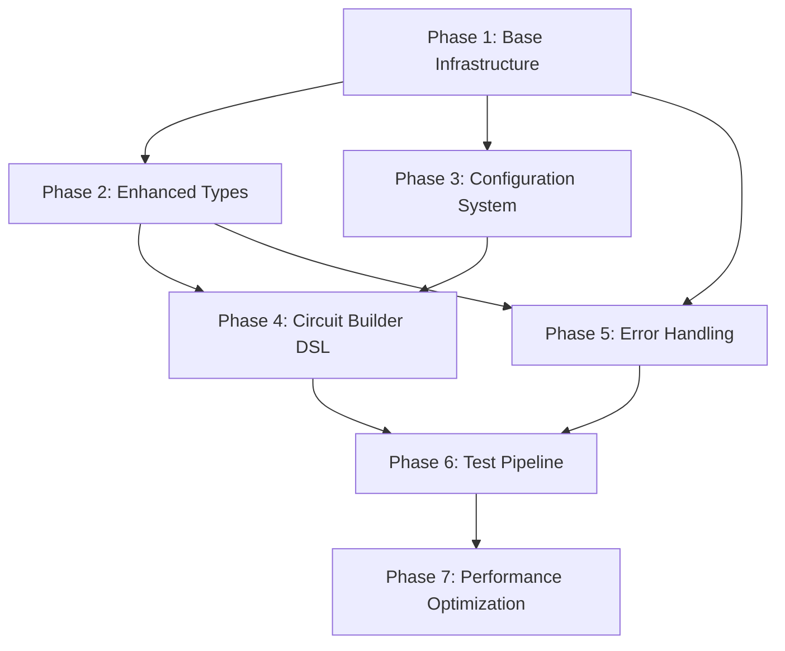

# 🎯 **Comprehensive CPU Validation Refactoring Plan**

## 📋 **Overview & Strategy**

**Approach**: Incremental refactoring with continuous validation to maintain 100% test compatibility throughout the process.

**Risk Mitigation**: Each phase includes rollback checkpoints and comprehensive testing before proceeding.

## 📊 **Current State Analysis**

### **Code Metrics**
- **Level 1**: 1,789 lines, 58 methods across 3 classes
- **Level 2**: 2,071 lines, 61 methods across 3 classes  
- **Duplication**: ~40% shared infrastructure code
- **Type Safety**: 100% (MyPy/Pyright compliant)
- **Code Quality**: Excellent (9.75-9.86/10 PyLint)

### **Major Issues Identified**
1. **Massive Code Duplication**: 400+ lines of identical infrastructure code
2. **Hardcoded Test Configurations**: All test definitions embedded in code
3. **Verbose Circuit Creation**: 50+ lines for simple circuits
4. **Primitive Type System**: Basic types don't capture domain semantics
5. **Monolithic Test Methods**: Each method mixes multiple concerns
6. **Basic Error Handling**: Repetitive try/catch patterns everywhere

## 🗂️ **Phase Dependencies Analysis**



## 🎯 **Expected Improvements**

| Metric | Before | After | Improvement |
|--------|--------|-------|-------------|
| **Total Lines** | 3,860 | ~2,000 | **48% reduction** |
| **Code Duplication** | ~40% | <5% | **35pp reduction** |
| **Test Configuration** | Hardcoded | External | **100% configurable** |
| **Circuit Creation** | 50+ lines | 5-10 lines | **80% reduction** |
| **Maintainability** | Low | High | **Significantly better** |

## 🚀 **PHASE 1: Base Infrastructure Foundation**

**Duration**: 3-4 days | **Risk**: Low | **Impact**: Massive

### **1.1 Create Base Framework** (Day 1)

**Objective**: Extract 400+ lines of duplicated code into shared base class.

**Tasks**:
```python
# Create: framework/base_validator.py
class CPUValidationFramework:
    """Base validation framework with shared functionality."""
    
    def __init__(self, level_name: str, config: Optional[FrameworkConfig] = None) -> None:
        self.bridge: Optional[WiredPandaBridge] = None
        self.test_results: List[Dict[str, Any]] = []
        self.current_test: Optional[str] = None
        self.level_name = level_name
        
        # Layout constants for proper element positioning
        self.ELEMENT_WIDTH = 64
        self.ELEMENT_HEIGHT = 64
        self.LABEL_OFFSET = 64
        self.MIN_VERTICAL_SPACING = 130
        self.MIN_HORIZONTAL_SPACING = 150
        self.GRID_START_X = 80
        self.GRID_START_Y = 100

    def _ensure_bridge(self) -> None:
        """Ensure bridge is connected"""
        if not self.bridge:
            self.bridge = WiredPandaBridge()
            self.bridge.start()

    def _get_grid_position(self, col: int, row: int) -> Tuple[float, float]:
        """Get grid-based position with proper spacing for elements and labels."""
        x = float(self.GRID_START_X + col * self.MIN_HORIZONTAL_SPACING)
        y = float(self.GRID_START_Y + row * self.MIN_VERTICAL_SPACING)
        return x, y

    def _get_input_position(self, index: int) -> Tuple[float, float]:
        """Get position for input elements in a vertical stack."""
        return self._get_grid_position(0, index)

    def _get_output_position(self, col: int, row: int = 0) -> Tuple[float, float]:
        """Get position for output elements."""
        return self._get_grid_position(col, row)

    def create_new_circuit(self) -> bool:
        """Create a new circuit by starting the application."""
        try:
            self._ensure_bridge()
            assert self.bridge is not None  # Type narrowing
            self.bridge.new_circuit()
            return True
        except WiredPandaError:
            return False

    def save_circuit(self, file_path: str) -> bool:
        """Save the current circuit to a file."""
        try:
            self._ensure_bridge()
            assert self.bridge is not None  # Type narrowing
            self.bridge.save_circuit(file_path)
            return True
        except WiredPandaError:
            return False

    def create_element(
        self, element_type: str, x: float, y: float, label: str = ""
    ) -> Optional[int]:
        """Create a circuit element at the specified position."""
        try:
            self._ensure_bridge()
            assert self.bridge is not None  # Type narrowing
            return self.bridge.create_element(element_type, x, y, label)
        except WiredPandaError:
            return None

    def connect_elements(
        self,
        source_id: int,
        source_port: int,
        target_id: int,
        target_port: int,
    ) -> bool:
        """Connect two elements."""
        try:
            self._ensure_bridge()
            assert self.bridge is not None  # Type narrowing
            self.bridge.connect_elements(source_id, source_port, target_id, target_port)
            return True
        except WiredPandaError:
            return False

    def start_simulation(self) -> bool:
        """Start the simulation."""
        try:
            self._ensure_bridge()
            assert self.bridge is not None  # Type narrowing
            self.bridge.start_simulation()
            return True
        except WiredPandaError:
            return False

    def step_simulation(self) -> bool:
        """Step the simulation (uses restart in wiRedPanda)."""
        try:
            self._ensure_bridge()
            # Note: Real wiRedPanda doesn't have step mode, use restart instead
            assert self.bridge is not None  # Type narrowing
            self.bridge.restart_simulation()
            return True
        except WiredPandaError:
            return False

    def set_input(self, element_id: int, value: bool) -> bool:
        """Set input element value."""
        try:
            self._ensure_bridge()
            assert self.bridge is not None  # Type narrowing
            self.bridge.set_input_value(element_id, value)
            return True
        except WiredPandaError:
            return False

    def get_output(self, element_id: int) -> Optional[bool]:
        """Get output element value."""
        try:
            self._ensure_bridge()
            assert self.bridge is not None  # Type narrowing
            return self.bridge.get_output_value(element_id)
        except WiredPandaError:
            return None

    def cleanup(self) -> None:
        """Clean up resources"""
        if self.bridge:
            self.bridge.stop()
            self.bridge = None

    def run_all_tests(self) -> Dict[str, Any]:
        """Run all tests and return comprehensive results."""
        raise NotImplementedError("Subclasses must implement run_all_tests")
```

**Migration Strategy**:
1. Extract common code to base class (no behavior changes)
2. Update existing classes to inherit from base
3. Run full test suite to verify no regressions

**Commands**:
```bash
# Create framework directory
mkdir -p framework
touch framework/__init__.py

# Create base validator
# (See code above)

# Update existing validators to inherit
# AdvancedCombinationalValidator(CPUValidationFramework)
# ArithmeticBlocksValidator(CPUValidationFramework)

# Test migration
python3 cpu_level_1_advanced_combinational.py  # Must show 4/4 passed
python3 cpu_level_2_arithmetic_blocks.py       # Must show 4/4 passed
```

**Deliverables**:
- ✅ `framework/base_validator.py` (400+ lines extracted)
- ✅ Updated `AdvancedCombinationalValidator(CPUValidationFramework)`
- ✅ Updated `ArithmeticBlocksValidator(CPUValidationFramework)`
- ✅ 100% test compatibility maintained

### **1.2 Shared Type Definitions** (Day 2)

**Objective**: Eliminate duplicated type definitions across files.

**Tasks**:
```python
# Create: framework/common_types.py
from typing import Any, Callable, Dict, List, Optional, Tuple, TypedDict

class TestCase(TypedDict):
    """Test case result structure."""
    inputs: Dict[str, Any]
    expected: Dict[str, Any]
    actual: Dict[str, Any]
    correct: bool

class TestResult(TypedDict):
    """Test result structure."""
    success: bool
    description: str
    total_cases: int
    passed_cases: int
    failed_cases: int
    sample_results: List[TestCase]
    accuracy: float
    error: Optional[str]

# Type aliases for better readability
ElementID = int
BitList = List[bool]
InputIDs = List[ElementID]
OutputIDs = List[ElementID]
LogicFunction = Callable[..., bool]

# Configuration types
class FrameworkConfig(TypedDict, total=False):
    """Configuration for validation framework."""
    layout_config: Dict[str, Any]
    error_handling_config: Dict[str, Any]
    performance_config: Dict[str, Any]
```

**Migration**:
1. Move type definitions to common module
2. Update imports in both validation files
3. Verify no circular import issues

**Commands**:
```bash
# Update imports in existing files
# From: class TestCase(TypedDict): ...
# To: from framework.common_types import TestCase, TestResult, ElementID, ...

# Verify compilation
python3 -m py_compile cpu_level_1_advanced_combinational.py
python3 -m py_compile cpu_level_2_arithmetic_blocks.py
```

**Success Criteria**: Code compiles, tests pass, no import errors