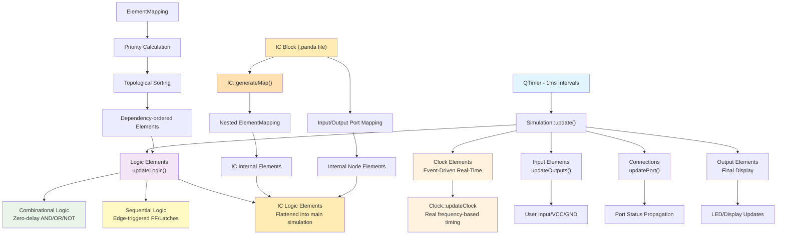
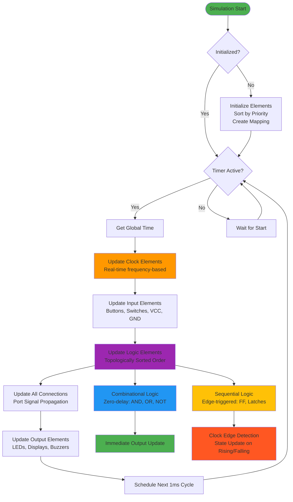

# wiRedPanda Simulation Analysis

## Overview

wiRedPanda implements a **Hybrid Synchronous Cycle-Based with Event-Driven Clocks** simulation engine designed specifically for educational purposes. The simulation prioritizes conceptual correctness and educational clarity over real-world timing accuracy.

## Simulation Architecture

### Core Design Philosophy

The simulation engine uses a dual-model approach:

1. **Primary Model**: Synchronous cycle-based simulation with fixed intervals
2. **Secondary Model**: Event-driven clock elements with real-time timing

### Architecture Diagram



### Simulation Flow Chart



### Implementation Details

#### Fixed Update Cycle
- **Interval**: 1ms fixed intervals via QTimer (`simulation.cpp:22`)
- **Update Sequence** (per cycle):
  1. Update clock elements with real-time timing
  2. Update input elements (`updateOutputs()`)
  3. Update all logic elements (`updateLogic()`)
  4. Update connections (`updatePort()`)
  5. Update output elements

```cpp
// simulation.cpp:26-57
void Simulation::update()
{
    // Clock elements (event-driven)
    for (auto *clock : std::as_const(m_clocks)) {
        clock->updateClock(globalTime);
    }

    // Input elements
    for (auto *inputElm : std::as_const(m_inputs)) {
        inputElm->updateOutputs();
    }

    // Logic elements (combinational and sequential)
    for (auto &logic : m_elmMapping->logicElms()) {
        logic->updateLogic();
    }

    // Connection propagation
    for (auto *connection : std::as_const(m_connections)) {
        updatePort(connection->startPort());
    }

    // Output elements
    for (auto *outputElm : std::as_const(m_outputs)) {
        for (auto *inputPort : outputElm->inputs()) {
            updatePort(inputPort);
        }
    }
}
```

#### Element Update Ordering
- **Priority-based topological sorting** prevents race conditions
- Elements sorted by dependency depth for correct signal propagation

```cpp
// elementmapping.cpp:102-104
std::sort(m_logicElms.begin(), m_logicElms.end(), [](const auto &logic1, const auto &logic2) {
    return logic1->priority() > logic2->priority();
});
```

## Logic Element Behavior

### Combinational Logic (Zero-Delay)
All combinational gates update **immediately** without propagation delays:

```cpp
// logicand.cpp:13-21
void LogicAnd::updateLogic()
{
    if (!updateInputs()) {
        return;
    }

    const auto result = std::accumulate(m_inputValues.cbegin(), m_inputValues.cend(), true, std::bit_and<>());
    setOutputValue(result);  // Immediate, zero-delay update
}
```

### Sequential Logic (Edge-Triggered)
Sequential elements implement proper edge-triggered behavior:

```cpp
// logicdflipflop.cpp:26-29
if (clk && !m_lastClk) {  // Rising edge detection
    q0 = m_lastValue;
    q1 = !m_lastValue;
}
```

### Clock Elements (Event-Driven Real-Time)
Clock elements operate independently with configurable frequencies:

```cpp
// clock.cpp:40-52
void Clock::updateClock(const std::chrono::steady_clock::time_point &globalTime)
{
    if (m_locked) {
        return;
    }

    const auto elapsed = std::chrono::duration_cast<std::chrono::microseconds>(globalTime - m_startTime);

    if (elapsed > m_interval) {
        m_startTime += m_interval;
        setOn(!m_isOn);  // Toggle based on frequency
    }
}
```

### IC (Integrated Circuit) Blocks - Hierarchical Simulation

IC blocks in wiRedPanda implement **hierarchical circuit simulation** by creating nested simulation contexts that are **flattened into the main simulation**.

#### IC Block Architecture

**File-Based Circuit Definition**:
- IC blocks are defined by external `.panda` files
- Each IC contains its own circuit topology with inputs, outputs, and internal logic
- File watching enables hot-reloading when IC definitions change

**Nested ElementMapping**:
```cpp
// ic.cpp:394-398
const QVector<std::shared_ptr<LogicElement>> IC::generateMap()
{
    mapping = new ElementMapping(m_icElements);  // Create nested mapping
    return mapping->logicElms();                 // Return flattened logic elements
}
```

**Flattening Process**:
```cpp
// elementmapping.cpp:31-34
if (elm->elementType() == ElementType::IC) {
    auto *ic = qobject_cast<IC *>(elm);
    m_logicElms.append(ic->generateMap());  // Flatten IC into main simulation
    continue;
}
```

#### Port Mapping and Interface

**Input/Output Transformation**:
- IC input/output elements are replaced with internal `Node` elements
- External connections are rewired to internal node representations
- Port ordering maintains spatial positioning from the IC layout

```cpp
// ic.cpp:273-299 (loadInputElement)
auto *nodeElm = ElementFactory::buildElement(ElementType::Node);
nodeElm->setPos(elm->pos());
nodeElm->setLabel(elm->label().isEmpty() ?
                      ElementFactory::typeToText(elm->elementType())
                    : elm->label());

m_icInputs.append(nodeInput);      // Map to external interface
m_icElements.append(nodeElm);      // Add to internal circuit

// Rewire external connections to internal node
for (auto *conn : conns) {
    conn->setStartPort(nodeElm->outputPort());
}
```

**Port Access Interface**:
```cpp
// ic.cpp:344-352
LogicElement *IC::inputLogic(const int index) {
    return m_icInputs.at(index)->logic();   // Direct access to internal logic
}

LogicElement *IC::outputLogic(const int index) {
    return m_icOutputs.at(index)->logic();  // Direct access to internal logic
}
```

#### Simulation Integration

**Transparent Integration**:
- IC contents are **completely flattened** into the main simulation
- No separate simulation context - all logic elements updated together
- Maintains same 1ms cycle with zero-delay propagation through IC boundaries

**Connection Handling**:
```cpp
// elementmapping.cpp:80-83
if (predecessorElement->elementType() == ElementType::IC) {
    auto *predecessorLogic = qobject_cast<IC *>(predecessorElement)->outputLogic(outputPort->index());
    currentLogic->connectPredecessor(inputIndex, predecessorLogic, 0);
}
```

**Port Status Updates**:
```cpp
// simulation.cpp:67-69
if (elm->elementType() == ElementType::IC) {
    auto *logic = qobject_cast<IC *>(elm)->outputLogic(port->index());
    port->setStatus(logic->isValid() ? static_cast<Status>(logic->outputValue(0)) : Status::Invalid);
}
```

#### Key Characteristics

**✅ Advantages:**
1. **True Hierarchical Design**: Supports nested circuit composition
2. **Seamless Integration**: IC boundaries are transparent to simulation
3. **Hot Reloading**: File watcher enables real-time IC updates
4. **Spatial Preservation**: Port ordering respects visual layout
5. **Performance**: Flattening eliminates hierarchy overhead

**⚠️ Limitations:**
1. **No Isolation**: No timing or electrical isolation between IC levels
2. **Static Flattening**: Cannot support dynamic reconfiguration
3. **Memory Usage**: Large ICs duplicate logic elements in memory
4. **Debug Complexity**: Flattened simulation makes hierarchical debugging difficult

#### Implementation Classification

**Design Pattern**: **Hierarchical Flattening**
- Circuits maintain logical hierarchy in definition
- Simulation operates on flattened netlist for performance
- Zero-delay propagation maintained across all hierarchy levels
- Compatible with educational goals of conceptual clarity

## Educational Design Goals

### ✅ Pedagogical Strengths

1. **Conceptual Accuracy**: Correctly implements Boolean logic and sequential behavior
2. **Immediate Feedback**: Zero-delay model provides instant visual response
3. **Race Condition Prevention**: Topological sorting ensures deterministic behavior
4. **Simplified Learning**: Students focus on logic concepts without timing complexity
5. **Interactive Experience**: Real-time clock elements enhance engagement

### 🎯 Target Learning Objectives

- **Boolean Algebra**: Perfect for teaching AND, OR, NOT operations
- **Combinational Design**: Excellent for multiplexers, decoders, adders
- **Sequential Concepts**: Clear demonstration of flip-flops, latches, state machines
- **Circuit Topology**: Understanding signal flow and dependencies

## Simulation Limitations

### ⚠️ Real-World Abstraction Gaps

#### 1. **Timing Analysis Limitations**
- **No Propagation Delays**: Real gates have 1-100ns delays
- **No Setup/Hold Times**: Real flip-flops require timing margins (typically 0.1-1ns)
- **No Clock Skew**: Real systems have clock distribution delays
- **No Race Conditions**: Real circuits can have hazards and glitches

#### 2. **Physical Implementation Gaps**
- **No Fan-out Limitations**: Real gates can only drive limited loads
- **No Drive Strength**: No consideration of signal strength degradation
- **No Power Consumption**: Missing power analysis capabilities
- **No Temperature Effects**: Real circuits are temperature-dependent

#### 3. **Advanced Digital System Limitations**
- **Single Clock Domain**: No multi-clock synchronization challenges
- **No Metastability**: Missing critical synchronizer behavior
- **No Signal Integrity**: No consideration of transmission line effects
- **No EMI/Noise**: Missing electromagnetic interference simulation

#### 4. **Industrial Design Constraints**
- **No Manufacturing Tolerances**: Real components have parameter variations
- **No Aging Effects**: Missing long-term reliability considerations
- **No Process Variations**: Real chips have manufacturing differences
- **No Electrostatic Discharge (ESD)**: Missing protection circuit modeling

#### 5. **Performance Analysis Gaps**
- **No Critical Path Analysis**: Cannot identify timing bottlenecks
- **No Static Timing Analysis**: Missing comprehensive timing verification
- **No Power Optimization**: No low-power design considerations
- **No Area Optimization**: Missing silicon area constraints

#### 6. **Communication Protocol Limitations**
- **No Bus Protocols**: Missing I²C, SPI, UART timing requirements
- **No Memory Interface Timing**: DDR, SRAM access patterns not modeled
- **No High-Speed Digital**: Missing SerDes, PCIe timing constraints

#### 7. **IC Block and Hierarchy Limitations**
- **No Hierarchy Timing Isolation**: IC boundaries have no timing impact
- **Static Flattening Only**: Cannot model dynamic reconfiguration or partial reconfiguration
- **No Interface Timing**: Missing setup/hold requirements across IC boundaries
- **Memory Duplication**: Large IC hierarchies consume significant memory
- **Limited Debug Visibility**: Flattened simulation obscures hierarchical structure
- **No Power Domains**: Missing power management across hierarchy levels

### 🚫 **What This Simulation Cannot Teach**

1. **Real-world timing closure** for ASIC/FPGA designs
2. **Signal integrity analysis** for high-speed designs
3. **Power management** and low-power design techniques
4. **Manufacturing test** and design-for-test methodologies
5. **Multi-clock domain** synchronization challenges
6. **Physical layout** impact on circuit performance

## Use Case Classification

### ✅ **Excellent For:**
- **Digital Logic Courses**: CS/EE undergraduate education
- **Circuit Design Basics**: Teaching fundamental concepts
- **Hierarchical Design Education**: Teaching modular circuit composition with IC blocks
- **Rapid Prototyping**: Quick verification of logic functionality
- **Algorithm Visualization**: Demonstrating digital algorithms
- **Educational Demonstrations**: Classroom teaching aid
- **Reusable Component Libraries**: Building and sharing IC block collections

### ⚠️ **Not Suitable For:**
- **ASIC/FPGA Development**: Requires timing-accurate simulation
- **High-Speed Design**: Missing critical timing analysis
- **Production Verification**: Needs comprehensive timing models
- **Mixed-Signal Systems**: Missing analog circuit interaction
- **Safety-Critical Systems**: Requires formal verification methods

## Conclusion

wiRedPanda's simulation engine successfully achieves its **educational mission** by providing conceptually accurate digital logic simulation while deliberately abstracting physical implementation complexities. This design choice makes it an excellent tool for teaching fundamental digital concepts but limits its applicability for professional hardware development.

The zero-delay abstraction is pedagogically sound: students learn correct logic behavior before tackling timing complexity. However, users transitioning to professional tools should understand these limitations and the additional timing considerations required for real hardware implementation.

### Design Philosophy Summary
> **"Teach logic functionality correctly before implementation complexity"**

This simulation prioritizes **conceptual understanding** over **implementation accuracy**, making it ideal for educational environments where the goal is to build strong foundational knowledge in digital logic principles.
