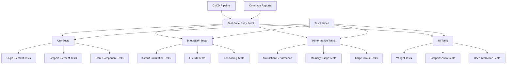

# Design Document

## Overview

The wiRedPanda test suite improvement will transform the current basic Qt Test framework implementation into a comprehensive, maintainable, and reliable testing infrastructure. The design addresses critical compilation issues, expands test coverage across all 33+ element types, implements integration testing for complete circuit simulations, adds performance benchmarking, and establishes CI/CD automation.

The current test suite has several architectural problems: missing Qt module dependencies, incomplete element coverage (only testing ~15 of 33+ element types), lack of integration tests, no performance monitoring, and no automated execution. This design provides a systematic solution to create a production-ready test infrastructure.

## Architecture

### Test Framework Structure



### Component Architecture

The test suite will be organized into distinct layers:

1. **Test Infrastructure Layer**: Core testing utilities, fixtures, and helper classes
2. **Unit Test Layer**: Individual component testing for logic elements, graphic elements, and core classes
3. **Integration Test Layer**: End-to-end testing of complete workflows and circuit simulations
4. **Performance Test Layer**: Benchmarking and performance regression detection
5. **UI Test Layer**: User interface component testing and interaction simulation

## Components and Interfaces

### Test Infrastructure Components

#### TestFixture Base Class
```cpp
class TestFixture : public QObject {
    Q_OBJECT
protected:
    virtual void setupTestEnvironment();
    virtual void cleanupTestEnvironment();
    Scene* createTestScene();
    Simulation* createTestSimulation(Scene* scene);
};
```

#### CircuitBuilder Utility
```cpp
class CircuitBuilder {
public:
    CircuitBuilder& addElement(ElementType type, const QString& name = "");
    CircuitBuilder& connect(const QString& from, const QString& to);
    CircuitBuilder& setInput(const QString& element, bool value);
    Scene* build();
    
private:
    QMap<QString, GraphicElement*> elements;
    QList<QPair<QString, QString>> connections;
};
```

#### TestMatchers for Assertions
```cpp
class SimulationMatcher {
public:
    static bool verifyTruthTable(LogicElement* element, 
                                const QVector<QVector<bool>>& truthTable);
    static bool verifyStateTransition(LogicElement* element,
                                    const QVector<bool>& inputs,
                                    const QVector<bool>& expectedOutputs);
};
```

### Unit Test Components

#### Enhanced Logic Element Tests
- **Complete Element Coverage**: Tests for all 33+ element types defined in ElementType enum
- **Truth Table Validation**: Comprehensive truth table testing for all logic gates
- **State Machine Testing**: Proper testing of flip-flops, latches, and memory elements
- **Edge Case Testing**: Invalid inputs, boundary conditions, and error states

#### Graphic Element Tests
- **Rendering Tests**: Verify visual element creation and properties
- **Port Management**: Test input/output port creation and connections
- **Serialization Tests**: Verify save/load functionality for each element type

### Integration Test Components

#### Circuit Simulation Tests
- **End-to-End Workflows**: Complete circuit creation, simulation, and result verification
- **Multi-Element Circuits**: Complex circuits with multiple interconnected elements
- **Example Circuit Validation**: Automated testing of all example .panda files
- **IC Integration**: Custom IC creation, loading, and usage in larger circuits

#### File I/O Integration Tests
- **File Format Compatibility**: Test loading of various .panda file versions
- **Export Functionality**: Verify Arduino code generation and waveform exports
- **Error Handling**: Test behavior with corrupted or invalid files

### Performance Test Components

#### Simulation Performance Benchmarks
- **Element Performance**: Individual element simulation speed measurements
- **Circuit Size Scaling**: Performance testing with circuits of varying complexity
- **Memory Usage Monitoring**: Track memory consumption during simulation
- **Regression Detection**: Automated detection of performance degradation

### UI Test Components

#### Widget Testing Framework
- **MainWindow Tests**: Menu actions, toolbar functionality, and window management
- **Dialog Tests**: Element editor, clock dialog, and other UI dialogs
- **Graphics View Tests**: Circuit editing, zoom, pan, and selection operations
- **Workspace Tests**: Multi-tab functionality and workspace management

## Data Models

### Test Configuration Model
```cpp
struct TestConfiguration {
    bool enablePerformanceTests = true;
    bool enableUITests = true;
    int performanceTestTimeout = 30000; // ms
    QString testDataDirectory = "test/data";
    QStringList excludedTests;
};
```

### Test Result Model
```cpp
struct TestResult {
    QString testName;
    bool passed;
    qint64 executionTime;
    QString errorMessage;
    QVariantMap metrics; // For performance data
};
```

### Circuit Test Data Model
```cpp
struct CircuitTestData {
    QString circuitFile;
    QMap<QString, bool> inputs;
    QMap<QString, bool> expectedOutputs;
    int simulationSteps = 1;
    QString description;
};
```

## Error Handling

### Compilation Error Resolution
- **Qt Module Dependencies**: Ensure all required Qt modules (core, gui, widgets, testlib, multimedia) are properly linked
- **Header Inclusion**: Fix missing header includes and forward declarations
- **Build Configuration**: Update .pro files with correct include paths and dependencies

### Runtime Error Handling
- **Test Isolation**: Each test runs in isolated environment to prevent cross-contamination
- **Resource Management**: Proper cleanup of Qt objects and memory management
- **Exception Handling**: Graceful handling of simulation errors and invalid states

### Test Failure Analysis
- **Detailed Error Messages**: Clear, actionable error messages for test failures
- **Debug Information**: Logging and debugging utilities for test troubleshooting
- **Failure Categorization**: Distinguish between compilation, runtime, and assertion failures

## Testing Strategy

### Test Organization
```
test/
├── unit/
│   ├── elements/          # Individual element tests
│   ├── logic/            # Logic element tests  
│   ├── graphics/         # Graphics element tests
│   └── core/             # Core component tests
├── integration/
│   ├── simulation/       # End-to-end simulation tests
│   ├── files/           # File I/O tests
│   └── circuits/        # Complete circuit tests
├── performance/
│   ├── benchmarks/      # Performance benchmarks
│   └── regression/      # Performance regression tests
├── ui/
│   ├── widgets/         # Widget tests
│   └── interactions/    # User interaction tests
├── fixtures/
│   ├── circuits/        # Test circuit files
│   └── data/           # Test data files
└── utils/
    ├── builders/        # Test utility classes
    └── matchers/       # Custom assertion matchers
```

### Test Execution Strategy
1. **Fast Unit Tests**: Run first for quick feedback
2. **Integration Tests**: Run after unit tests pass
3. **Performance Tests**: Run on dedicated hardware/CI agents
4. **UI Tests**: Run in headless mode where possible

### Coverage Strategy
- **Line Coverage**: Target 80%+ line coverage for core simulation logic
- **Branch Coverage**: Ensure all conditional paths are tested
- **Element Coverage**: 100% coverage of all ElementType enum values
- **Integration Coverage**: All major user workflows covered

### CI/CD Integration
- **Automated Execution**: Tests run on every commit and pull request
- **Multi-Platform Testing**: Windows, Linux, and macOS test execution
- **Performance Monitoring**: Track performance metrics over time
- **Coverage Reporting**: Generate and publish coverage reports
- **Test Result Visualization**: Clear reporting of test results and trends