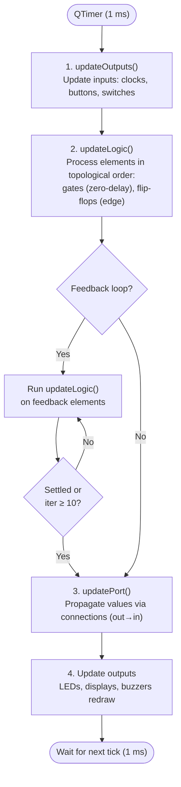

# wiRedPanda Developer Guide

A comprehensive guide for new developers joining the wiRedPanda project. This document walks you through the codebase architecture, the simulation engine, how to add new elements, how to write tests, and where to find things.

If you are looking for build instructions, see [BUILD.md](BUILD.md). For contribution workflow (PRs, code style, translations), see [CONTRIBUTING.md](CONTRIBUTING.md).

## Table of Contents

- [What is wiRedPanda?](#what-is-wiredpanda)
- [Getting Started](#getting-started)
- [Project Structure](#project-structure)
- [Architecture Overview](#architecture-overview)
- [Core Layer (App/Core)](#core-layer-appcore)
- [The Element System (App/Element)](#the-element-system-appelement)
  - [Class Hierarchy](#class-hierarchy)
  - [GraphicElement: The Base Class](#graphicelement-the-base-class)
  - [ElementFactory](#elementfactory)
  - [How Elements Register Themselves](#how-elements-register-themselves)
  - [ElementMetadata and ElementConstraints](#elementmetadata-and-elementconstraints)
  - [Element Catalog](#element-catalog)
  - [Anatomy of a Logic Gate](#anatomy-of-a-logic-gate)
  - [Anatomy of a Sequential Element](#anatomy-of-a-sequential-element)
  - [Anatomy of an Input Element](#anatomy-of-an-input-element)
  - [Integrated Circuits (ICs)](#integrated-circuits-ics)
- [Four-State Logic](#four-state-logic)
- [The Simulation Engine (App/Simulation)](#the-simulation-engine-appsimulation)
  - [Simulation Loop](#simulation-loop)
  - [Topological Sorting](#topological-sorting)
  - [Feedback Loop Handling](#feedback-loop-handling)
- [Ports and Connections (App/Wiring)](#ports-and-connections-appwiring)
- [The Scene and Undo/Redo System (App/Scene)](#the-scene-and-undoredo-system-appscene)
- [User Interface (App/UI)](#user-interface-appui)
- [File Serialization (App/IO)](#file-serialization-appio)
- [Code Generation (App/CodeGen)](#code-generation-appcodegen)
- [BeWavedDolphin (Waveform Viewer)](#bewaveddolphin-waveform-viewer)
- [Resources and Internationalization](#resources-and-internationalization)
- [The Test System](#the-test-system)
  - [Test Organization](#test-organization)
  - [Test Utilities and CircuitBuilder](#test-utilities-and-circuitbuilder)
  - [Writing Your First Test](#writing-your-first-test)
  - [Testing Sequential Logic](#testing-sequential-logic)
  - [Running Tests](#running-tests)
  - [Coverage and Sanitizers](#coverage-and-sanitizers)
- [CI/CD and Workflows](#cicd-and-workflows)
- [How To: Add a New Element](#how-to-add-a-new-element)
- [How To: Add a New Test](#how-to-add-a-new-test)
- [Git Workflow](#git-workflow)
- [Suggested Learning Path](#suggested-learning-path)
- [Starter Tasks](#starter-tasks)
- [Tips and Common Pitfalls](#tips-and-common-pitfalls)
- [Key Files Reference](#key-files-reference)
- [Glossary](#glossary)
- [Additional Resources](#additional-resources)

---

## What is wiRedPanda?

wiRedPanda is an open-source digital logic circuit simulator designed for education. Students can drag-and-drop logic gates, flip-flops, switches, LEDs, and other components onto a canvas, wire them together, and watch the simulation run in real time.

The project is maintained by [GIBIS-UNIFESP](https://github.com/GIBIS-UNIFESP) and licensed under **GPL v3.0**.

### Key Features

- **Real-time simulation** of combinational and sequential logic circuits
- **Intuitive GUI** based on Qt6 with drag-and-drop
- **Cross-platform**: Linux, macOS, Windows, and WebAssembly
- **Integrated Circuits (ICs)**: create reusable sub-circuits from `.panda` files
- **Export**: images, PDF, Arduino code, and SystemVerilog
- **Waveform viewer**: BeWavedDolphin tool for temporal analysis
- **Guided learning**: built-in UI Tours and step-by-step circuit Exercises, with a tour auto-started on first launch
- **39 languages** supported via Weblate

### Tech Stack

| Component       | Technology                           |
|-----------------|--------------------------------------|
| Language        | C++20                                |
| UI Framework    | Qt 6.2+                              |
| Build System    | CMake 3.27+ with Ninja               |
| Tests           | Qt Test Framework + CTest            |
| CI/CD           | GitHub Actions                       |
| Crash Reporting | Sentry (Crashpad/Breakpad)           |
| Dependencies    | nlohmann/json, json-schema-validator |
| i18n            | Qt Linguist / Weblate                |

---

## Getting Started

### Recommended: Development Container

The fastest way to set up a working environment is the dev container:

1. Install [Docker](https://www.docker.com/) and [VS Code](https://code.visualstudio.com/) with the [Dev Containers extension](https://marketplace.visualstudio.com/items?itemName=ms-vscode-remote.remote-containers).
2. Clone the repository and open it in VS Code.
3. When prompted, select **"Reopen in Container"** (or use `Ctrl+Shift+P` > `Dev Containers: Reopen in Container`).
4. Build and run:

```bash
cmake --preset debug
cmake --build --preset debug
ctest --preset debug
```

The container includes:

- Ubuntu 24.04 LTS
- Qt 6.2+ with Multimedia and SVG modules
- CMake, Ninja, GCC 13+
- ccache (compilation cache)
- mold (fast linker)
- lcov (code coverage)

### Local Setup

See [BUILD.md](BUILD.md) for platform-specific instructions. The short version:

#### Ubuntu/Debian

```bash
sudo apt install build-essential cmake ninja-build \
    qt6-base-dev qt6-multimedia-dev qt6-svg-dev \
    ccache mold
```

#### Arch Linux

```bash
sudo pacman -S base-devel cmake ninja qt6-base qt6-multimedia qt6-svg ccache mold
```

#### macOS

```bash
brew install cmake ninja qt6 ccache
```

#### Windows

1. Install [Qt 6.2+](https://www.qt.io/download) with Multimedia and SVG modules.
2. Install [CMake](https://cmake.org/download/) and [Ninja](https://github.com/nicollasricas/ninja) (`choco install cmake ninja` or `scoop install cmake ninja`).
3. Configure Visual Studio Build Tools 2022 or later.

> **Note**: On Linux/macOS, always use `python3` (never `python`). The `python` command may not exist or point to Python 2.

### Running the Application

```bash
./build/wiredpanda                                 # Linux
./build/wiredpanda.app/Contents/MacOS/wiredpanda    # macOS
./build/wiredpanda.exe                              # Windows
```

### Running Tests (Quick Reference)

```bash
ctest --preset debug                         # Run all tests
./build/test_wiredpanda TestLogicGates       # Run a specific test class
./build/test_wiredpanda -functions           # List all test classes
```

---

## Project Structure

```text
wiRedPanda/
├── App/                                    # All application source code
│   ├── Main.cpp                            #   Entry point
│   ├── Core/                               #   Central infrastructure
│   │   ├── Application.cpp/h               #     Custom QApplication
│   │   ├── Enums.cpp/h                     #     Central enums (ElementType, Status, etc.)
│   │   ├── Settings.cpp/h                  #     Persistent settings management
│   │   ├── ThemeManager.cpp/h              #     Theme system (light/dark/system)
│   │   ├── Priorities.h                    #     Topological sorting and update priorities
│   │   ├── ItemWithId.h                    #     Base with stable numeric identity
│   │   └── StatusOps.h                     #     Four-state logic operations
│   ├── Element/                            #   Logic elements and element factory
│   │   ├── GraphicElement.cpp/h            #     Abstract base class for all elements
│   │   ├── ElementFactory.cpp/h            #     Factory singleton
│   │   ├── ElementInfo.h                   #     Self-registration template
│   │   ├── ElementMetadata.cpp/h           #     Element metadata and capabilities
│   │   ├── PropertyDescriptor.h            #     Property system
│   │   ├── IC.cpp/h                        #     Integrated circuit (sub-circuit) element
│   │   ├── ICLoader.cpp/h                  #     Loads an IC's sub-circuit from file or embedded blob
│   │   ├── ICRenderer.cpp/h                #     Draws an IC's body and cached pixmaps
│   │   ├── ICSimulation.cpp/h              #     Builds/runs an IC's internal simulation graph
│   │   ├── GraphicElementSerializer.cpp/h  #     Serialization
│   │   └── GraphicElements/                #     31 concrete element implementations
│   ├── Simulation/                         #   Simulation engine
│   │   ├── Simulation.cpp/h                #     Main simulation loop
│   │   └── SimulationBlocker.cpp/h         #     Pause mechanism
│   ├── Wiring/                             #   Ports and wire connections
│   │   ├── Port.cpp/h                      #     Input/output ports
│   │   ├── Connection.cpp/h                #     Connections between ports
│   │   └── ConnectionSerializer.cpp/h      #     Connection save/load
│   ├── Scene/                              #   Graphics scene, undo/redo, workspace
│   │   ├── Scene.cpp/h                     #     Main QGraphicsScene
│   │   ├── Commands.cpp/h                  #     Undo/redo commands
│   │   ├── Workspace.cpp/h                 #     Workspace management
│   │   ├── ClipboardManager.cpp/h          #     Copy/paste
│   │   ├── ConnectionManager.cpp/h         #     Connection creation
│   │   └── ICRegistry.cpp/h                #     Central IC registry (moved here from App/Element/)
│   ├── IO/                                 #   File serialization
│   │   ├── Serialization.cpp/h             #     .panda format
│   │   └── RecentFiles.cpp/h               #     Recent files tracking
│   ├── UI/                                 #   MainWindow, dialogs, toolbars
│   │   ├── MainWindow.cpp/h                #     Main window
│   │   ├── ElementPalette.cpp/h            #     Element palette
│   │   ├── ElementEditor.cpp/h             #     Property editor
│   │   ├── CircuitExporter.cpp/h           #     Image/PDF export
│   │   ├── MinimapWidget.cpp/h             #     Draggable/resizable canvas overview widget
│   │   └── LanguageManager.cpp/h           #     Language management
│   ├── CodeGen/                            #   Arduino & SystemVerilog export
│   │   ├── ArduinoCodeGen.cpp/h            #     Arduino/C code generation
│   │   └── SystemVerilogCodeGen.cpp/h      #     SystemVerilog HDL
│   ├── BeWavedDolphin/                     #   Waveform viewer/editor
│   ├── Exercise/                           #   Circuit-challenge Exercise system
│   ├── Tour/                               #   Guided UI Tour system
│   └── Resources/                          #   SVGs, icons, translations
│       ├── Components/                     #     Element SVG icons by category
│       ├── Assets/                         #     App logos and icons
│       ├── Exercises/                      #     Built-in Exercise .json files
│       ├── Tours/                          #     Built-in Tour .json files
│       ├── Interface/                      #     UI resources
│       └── Translations/                   #     Translation files (.ts)
├── Tests/
│   ├── Common/                             #   Shared test utilities (TestUtils, CircuitBuilder)
│   ├── Unit/                               #   Unit tests by component area
│   ├── Integration/                        #   IC tests, code generation tests
│   ├── System/                             #   System-level tests (waveform)
│   ├── BackwardCompatibility/              #   Old file format test fixtures
│   ├── Resources/                          #   Resource validation tests
│   ├── Fixtures/                           #   Test .panda files
│   ├── Fuzz/                               #   libFuzzer harnesses (local/manual, not run in CI)
│   └── Runners/                            #   Unified test entry point
├── Examples/                               #   21 example .panda circuit files
├── MCP/                                    #   Model Context Protocol server (internal use)
├── Packaging/                              #   Distro packaging (AUR PKGBUILD, etc.)
├── Scripts/                                #   Build and utility scripts
├── .devcontainer/                          #   Dev container configuration
├── .github/workflows/                      #   CI/CD pipelines
├── CMakeLists.txt                          #   Top-level build configuration
├── CMakeSources.cmake                      #   Alphabetically sorted source file lists
├── CMakePresets.json                       #   Build presets (debug, release, asan, etc.)
├── pch.h                                   #   Precompiled header
├── BUILD.md                                #   Platform build instructions
└── CONTRIBUTING.md                         #   Contribution guidelines
```

### Key Organizational Principles

- **One element = one `.h`/`.cpp` pair** in `App/Element/GraphicElements/`.
- **Source file lists** live in `CMakeSources.cmake` (not `CMakeLists.txt`) and must stay **alphabetically sorted**.
- **All builds go into `build/`** — never build in the source tree.

### Build Presets

The project uses **CMake Presets** (`CMakePresets.json`) to standardize build configurations:

```bash
# Configure
cmake --preset debug        # or: release, relwithdebinfo

# Build
cmake --build --preset debug

# Test
ctest --preset debug
```

| Preset            | Purpose                                                                                            |
|-------------------|----------------------------------------------------------------------------------------------------|
| `debug`           | Development with debug symbols                                                                     |
| `release`         | Optimized build for distribution                                                                   |
| `relwithdebinfo`  | Release with symbols (deploy with Sentry)                                                          |
| `coverage`        | Code coverage instrumentation                                                                      |
| `asan`            | Address Sanitizer (invalid memory access)                                                          |
| `tsan`            | Thread Sanitizer (data races)                                                                      |
| `msan`            | Memory Sanitizer (Clang only, uninitialized mem)                                                   |
| `ubsan`           | Undefined Behavior Sanitizer                                                                       |
| `macos-universal` | Release build with universal x86_64+arm64 macOS binaries (Darwin only)                             |
| `fuzzer`          | Clang libFuzzer harnesses + ASan + UBSan (see [Coverage and Sanitizers](#coverage-and-sanitizers)) |
| `fuzzer-coverage` | Source-based coverage report over the fuzz corpus, no sanitizers                                   |
| `sentry-crashpad` | RelWithDebInfo build with the Sentry crashpad backend                                              |
| `sentry-breakpad` | RelWithDebInfo build with the Sentry breakpad backend (Darwin only)                                |

### Incremental Builds and Cache

The project is configured for fast builds:

- **ccache**: caches previous compilations. Partial recompilations are much faster.
- **mold**: modern parallel linker, significantly faster than `ld` or `gold`.
- **Unity Build**: source files are grouped to reduce compilation overhead (configurable in CMake).
- **Precompiled Headers (PCH)**: `pch.h` precompiles the most-used Qt headers.

> **Tip**: the first build may take several minutes. Subsequent builds with ccache take seconds.

---

## Architecture Overview

The application follows a layered architecture:

```text
┌─────────────────────────────────────┐
│           UI Layer (App/UI/)        │  MainWindow, dialogs, toolbars
├─────────────────────────────────────┤
│        Scene Layer (App/Scene/)     │  Canvas, undo/redo, clipboard
├─────────────────────────────────────┤
│      Element Layer (App/Element/)   │  Logic gates, flip-flops, I/O
├──────────────┬──────────────────────┤
│  Simulation  │   Nodes (Ports &     │  Engine loop, topological sort,
│  (App/Sim/)  │   Connections)       │  port/wire data model
├──────────────┴──────────────────────┤
│        Core Layer (App/Core/)       │  Enums, StatusOps, Settings
└─────────────────────────────────────┘
```

**Data flows bottom-up**: The simulation engine reads element connections and calls `updateLogic()` on each element in topological order. Elements compute their outputs from their inputs using the four-state logic system. The scene layer renders the results.

### Module Dependency Diagram

```text
                    ┌──────────────┐
                    │   Main.cpp   │
                    └──────┬───────┘
                           │
                    ┌──────▼───────┐
                    │  Application │
                    │   (Core/)    │
                    └──────┬───────┘
                           │
              ┌────────────┼────────────┐
              │            │            │
       ┌──────▼───────┐ ┌──▼──────┐ ┌───▼────────┐
       │  MainWindow  │ │  Scene  │ │ Simulation │
       │   (UI/)      │ │(Scene/) │ │(Simulation/│
       └──────┬───────┘ └──┬──────┘ └───┬────────┘
              │            │            │
              └────────────┼────────────┘
                           │
              ┌────────────┼────────────┐
              │            │            │
       ┌──────▼──────┐ ┌───▼─────┐ ┌────▼───────┐
       │  Elements   │ │  Nodes  │ │  Commands  │
       │ (Element/)  │ │(Nodes/) │ │  (Scene/)  │
       └─────────────┘ └─────────┘ └────────────┘
              │
       ┌──────▼──────┐
       │Serialization│
       │   (IO/)     │
       └─────────────┘
```

The **Scene** is the central point: it holds the elements, the connections, and coordinates with the **Simulation**. The **MainWindow** is the UI shell wrapping the Scene. **Elements** are independent of the UI and can be tested in isolation.

---

## Core Layer (App/Core)

### Application

`App/Core/Application.cpp/h` is a `QApplication` subclass that initializes:

- OS theme detection
- Persistent settings (via `QSettings`)
- Language/translation management
- Global exception handling

### Enums and Central Types

`App/Core/Enums.h` defines the fundamental enums:

#### `Status` (4-state logic)

```cpp
enum class Status {
    Unknown  = -1,  // Floating / unresolved (equivalent to VHDL 'U')
    Inactive =  0,  // Logic LOW (0)
    Active   =  1,  // Logic HIGH (1)
    Error    =  2,  // Bus conflict / indeterminate (X)
};
```

This 4-state system (inspired by VHDL's `std_logic`) is central to the entire simulation. Every port and connection carries a `Status` value.

#### `ElementType`

Each element type has a unique numeric identifier. Examples:

- `And = 5`, `Or = 6`, `Not = 4`
- `DFlipFlop = 17`, `JKFlipFlop = 18`
- `Led = 3`, `Display7 = 14`
- `IC = 22` (integrated circuit)
- `Node = 23` (wire junction / Tx/Rx wireless)

#### `ElementGroup`

Groups elements in the UI palette:

- `Gate` (logic gates), `Memory` (flip-flops and latches)
- `Input`, `Output`, `StaticInput` (VCC/GND)
- `Mux`, `IC`, `Other`

#### `WirelessMode`

Wireless node modes: `None` (default), `Tx` (transmitter), or `Rx` (receiver).

### Settings

`App/Core/Settings.cpp/h` wraps Qt's `QSettings` to persist user preferences:

- Last opened directory
- Selected language
- Theme
- Recent files

### Themes

`App/Core/ThemeManager.cpp/h` manages the UI themes:

- **Light**: light theme
- **Dark**: dark theme
- **System**: automatically follows the OS theme

`ThemeManager` detects OS theme changes in real time by connecting to Qt's cross-platform `QStyleHints::colorSchemeChanged` signal (Qt 6.5+; a palette-lightness heuristic is used as a fallback on older Qt), with several version-gated workarounds for Qt 6.8/6.9/6.10 differences in how pending theme-change events get flushed.

---

## The Element System (App/Element)

This is the most important subsystem of the project. All circuit components (logic gates, flip-flops, displays, etc.) are elements.

### Class Hierarchy

```text
QGraphicsObject
  └── GraphicElement              (abstract base — all circuit components)
        ├── GraphicElementInput   (abstract — user-interactive inputs)
        │     ├── InputSwitch     (toggle on/off)
        │     ├── InputButton     (momentary press)
        │     ├── InputRotary     (multi-position rotary switch)
        │     ├── InputVcc        (constant HIGH)
        │     ├── InputGnd        (constant LOW)
        │     └── Clock           (frequency-driven square wave)
        ├── And, Or, Not, ...     (combinational logic gates)
        ├── DFlipFlop, SRLatch... (sequential logic)
        ├── Led, Buzzer, Display  (output elements)
        ├── Mux, Demux            (multiplexing)
        ├── IC                    (sub-circuit / integrated circuit)
        └── Node, Line, Text      (structural/annotation)
```

### GraphicElement: The Base Class

`App/Element/GraphicElement.h` is the abstract base class for **all** graphic elements in the circuit. It inherits from:

- `QGraphicsObject`: visual representation in the Qt scene
- `ItemWithId`: stable numeric identity (for serialization and undo/redo)

**Responsibilities:**

- Port management (input and output)
- Rendering with pixmaps/skins
- Serialization to QDataStream (save/load)
- Grid-snapping (alignment to grid)
- Label display and keyboard triggers
- Selection highlighting

**Key methods that subclasses implement:**

```cpp
// Simulation logic — REQUIRED for functional elements
virtual void updateLogic() = 0;

// Custom serialization (optional)
virtual void save(QDataStream &stream) const;
virtual void load(QDataStream &stream, SerializationContext &context);
```

### ElementFactory

`App/Element/ElementFactory.h` is a **singleton** that creates elements from their `ElementType`:

```cpp
// Create a new AND element
GraphicElement *andGate = ElementFactory::buildElement(ElementType::And);

// Check if a type is registered
bool exists = ElementFactory::hasCreator(ElementType::And);

// Type ↔ string conversion
ElementType type = ElementFactory::textToType("And");
QString name = ElementFactory::typeToText(ElementType::And);
```

The factory does not manage IDs — that is the `Scene`'s responsibility.

### How Elements Register Themselves

wiRedPanda uses a **self-registering template pattern**. Each element specializes `ElementInfo<T>`, which:

1. Defines compile-time `ElementConstraints` (input/output count, group, features).
2. Provides a `metadata()` function returning display info (icon path, translated name).
3. Contains a `static inline const bool registered` lambda that runs at program startup to register the element with both `ElementMetadataRegistry` and `ElementFactory`.

This means: **no manual factory registration calls**. Just defining the `ElementInfo<T>` specialization in the `.cpp` file is enough to make the element available everywhere — in the palette, in serialization, and in tests.

The `ElementConstraints` are **validated at compile time** by the `constexpr validate()` function. A misconfigured element will not compile.

### ElementMetadata and ElementConstraints

`ElementConstraints` defines the restrictions for an element:

| Field                 | Description                                                                     |
|-----------------------|---------------------------------------------------------------------------------|
| `type`                | Element type (`ElementType`)                                                    |
| `group`               | Palette group (`ElementGroup`)                                                  |
| `minInputSize`        | Minimum number of input ports                                                   |
| `maxInputSize`        | Maximum number of input ports                                                   |
| `minOutputSize`       | Minimum number of output ports                                                  |
| `maxOutputSize`       | Maximum number of output ports                                                  |
| `canChangeAppearance` | Allows the user to assign a custom SVG appearance (e.g., ANSI/IEC)              |
| `hasColors`           | Has color option (e.g., LED)                                                    |
| `hasAudio`            | Produces sound (e.g., Buzzer)                                                   |
| `hasAudioBox`         | Has audio box capability (e.g., AudioBox)                                       |
| `hasTrigger`          | Can be triggered via keyboard                                                   |
| `hasFrequency`        | Configurable frequency (e.g., Clock)                                            |
| `hasDelay`            | Has configurable delay                                                          |
| `hasLabel`            | Displays a text label                                                           |
| `hasTruthTable`       | Based on a truth table                                                          |
| `hasVolume`           | Has volume control (e.g., Buzzer, AudioBox)                                     |
| `rotatesGraphic`      | Rotating/flipping re-orients the graphic (false = icon fixed, ports still move) |

`ElementMetadata` extends this with visual information: pixmap paths, translated names, and `defaultAppearances`/`alternativeAppearances` lists.

### Element Catalog

The 31 concrete elements live in `App/Element/GraphicElements/`:

#### Logic Gates (combinational)

| Element | File       | Inputs | Description                  |
|---------|------------|--------|------------------------------|
| AND     | `And.cpp`  | 2-8    | Output 1 if all inputs are 1 |
| OR      | `Or.cpp`   | 2-8    | Output 1 if any input is 1   |
| NOT     | `Not.cpp`  | 1      | Inverts the signal           |
| NAND    | `Nand.cpp` | 2-8    | Inverted AND                 |
| NOR     | `Nor.cpp`  | 2-8    | Inverted OR                  |
| XOR     | `Xor.cpp`  | 2-8    | Exclusive OR                 |
| XNOR    | `Xnor.cpp` | 2-8    | Inverted exclusive OR        |

#### Sequential Elements (memory)

| Element      | File             | Description                        |
|--------------|------------------|------------------------------------|
| D Flip-Flop  | `DFlipFlop.cpp`  | Stores data on clock edge          |
| JK Flip-Flop | `JKFlipFlop.cpp` | Versatile flip-flop with J, K, clk |
| SR Flip-Flop | `SRFlipFlop.cpp` | Set-Reset with clock edge          |
| T Flip-Flop  | `TFlipFlop.cpp`  | Toggle on clock edge               |
| D Latch      | `DLatch.cpp`     | Level-sensitive latch              |
| SR Latch     | `SRLatch.cpp`    | Level-sensitive set-reset          |

#### Inputs

| Element     | File              | Description                             |
|-------------|-------------------|-----------------------------------------|
| InputButton | `InputButton.cpp` | Momentary button (active while pressed) |
| InputSwitch | `InputSwitch.cpp` | Toggle switch (on/off)                  |
| InputRotary | `InputRotary.cpp` | Rotary switch with N positions          |
| InputVCC    | `InputVCC.cpp`    | Constant HIGH source (1)                |
| InputGND    | `InputGND.cpp`    | Constant LOW source (0)                 |

#### Outputs

| Element   | File            | Description                         |
|-----------|-----------------|-------------------------------------|
| Led       | `Led.cpp`       | LED indicator (with color option)   |
| Display7  | `Display7.cpp`  | 7-segment display                   |
| Display14 | `Display14.cpp` | 14-segment display (alphanumeric)   |
| Display16 | `Display16.cpp` | 16-segment display                  |
| Buzzer    | `Buzzer.cpp`    | Audio buzzer with configurable freq |
| AudioBox  | `AudioBox.cpp`  | Audio player                        |

#### Multiplexing

| Element | File        | Description                           |
|---------|-------------|---------------------------------------|
| Mux     | `Mux.cpp`   | Multiplexer: selects 1 of N inputs    |
| Demux   | `Demux.cpp` | Demultiplexer: routes input to 1 of N |

#### Utilities

| Element    | File             | Description                           |
|------------|------------------|---------------------------------------|
| Clock      | `Clock.cpp`      | Clock generator with adjustable freq  |
| Node       | `Node.cpp`       | Wire junction / wireless node (Tx/Rx) |
| Line       | `Line.cpp`       | Decorative line (no logic function)   |
| Text       | `Text.cpp`       | Text annotation                       |
| TruthTable | `TruthTable.cpp` | Element defined by a truth table      |

### Anatomy of a Logic Gate

Here is the complete AND gate, the simplest element to understand:

**`App/Element/GraphicElements/And.h`**:

```cpp
class And : public GraphicElement {
    Q_OBJECT
public:
    explicit And(QGraphicsItem *parent = nullptr);
    void updateLogic() override;
};
```

**`App/Element/GraphicElements/And.cpp`**:

```cpp
#include "And.h"

// 1. Registration: define constraints and metadata
template<>
struct ElementInfo<And> {
    static constexpr ElementConstraints constraints{
        .type = ElementType::And,
        .group = ElementGroup::Gate,
        .minInputSize = 2, .maxInputSize = 8,
        .minOutputSize = 1, .maxOutputSize = 1,
        .canChangeAppearance = true,
    };
    static_assert(validate(constraints));

    static ElementMetadata metadata() {
        auto meta = metadataFromConstraints(constraints);
        meta.pixmapPath = [] { return QStringLiteral(":/Components/Logic/and.svg"); };
        meta.titleText = QT_TRANSLATE_NOOP("And", "AND");
        meta.translatedName = QT_TRANSLATE_NOOP("And", "And");
        meta.trContext = "And";
        meta.defaultAppearances = {":/Components/Logic/and.svg"};
        return meta;
    }

    static inline const bool registered = [] {
        ElementMetadataRegistry::registerMetadata(metadata());
        ElementFactory::registerCreator(constraints.type, [] { return new And; });
        return true;
    }();
};

// 2. Constructor: just calls parent with the element type
And::And(QGraphicsItem *parent) : GraphicElement(ElementType::And, parent) {}

// 3. Logic: the one method that matters
void And::updateLogic() {
    if (!simUpdateInputsAllowUnknown()) return;
    setOutputValue(StatusOps::statusAndAll(simInputs()));
}
```

**What happens in `updateLogic()`:**

1. `simUpdateInputsAllowUnknown()` reads the current value from each connected predecessor's output port (or uses the port's default if unconnected). Returns `false` if a required input has no value — the element does nothing this cycle.
2. `simInputs()` returns a `QVector<Status>` snapshot of all input values.
3. `StatusOps::statusAndAll()` ANDs all inputs together using the four-state logic rules.
4. `setOutputValue()` writes the result to output port 0. If the value changed, the element is flagged for downstream propagation.

All other combinational gates (`Or`, `Not`, `Xor`, `Nand`, `Nor`, `Xnor`) follow this exact same three-part pattern. The only difference is the `StatusOps` function called.

### Anatomy of a Sequential Element

Sequential elements like flip-flops store internal state and respond to clock edges:

**D Flip-Flop** (`DFlipFlop.cpp`, simplified):

```cpp
void DFlipFlop::updateLogic() {
    if (!simUpdateInputs()) return;          // Strict: needs ALL inputs valid

    Status q0 = simOutputs().at(0);          // Current Q
    Status q1 = simOutputs().at(1);          // Current ~Q
    const Status D    = simInputs().at(0);   // Data input
    const Status clk  = simInputs().at(1);   // Clock input
    const Status prst = simInputs().at(2);   // Async preset (active-low)
    const Status clr  = simInputs().at(3);   // Async clear (active-low)

    // Rising edge detection
    if (clk == Status::Active && m_simLastClk == Status::Inactive) {
        q0 = m_simLastValue;                 // Latch D on rising edge
        q1 = (m_simLastValue == Status::Active) ? Status::Inactive : Status::Active;
    }

    // Asynchronous overrides (active-low, jointly evaluated)
    if (prst == Status::Inactive || clr == Status::Inactive) {
        q0 = (prst == Status::Inactive) ? Status::Active : Status::Inactive;
        q1 = (clr == Status::Inactive) ? Status::Active : Status::Inactive;
    }

    m_simLastClk = clk;
    m_simLastValue = D;
    setOutputValue(0, q0);
    setOutputValue(1, q1);
}
```

Key differences from combinational gates:

- Uses `simUpdateInputs()` (strict) instead of `simUpdateInputsAllowUnknown()`.
- Stores `m_simLastClk` and `m_simLastValue` across cycles for edge detection.
- Has custom port layout via `updatePortsProperties()` (Clock pin at bottom-left, Preset at top, etc.).

### Anatomy of an Input Element

Input elements like `InputSwitch` are driven by user interaction, not by upstream logic:

```cpp
// No updateLogic() — state is set by mouse events
void InputSwitch::mousePressEvent(QGraphicsSceneMouseEvent *event) {
    if (!m_locked && (event->button() == Qt::LeftButton)) {
        // Snapshot the pre-toggle state so the toggle can be pushed onto the undo
        // stack as an UpdateCommand, same as any other property edit.
        QByteArray oldData;
        auto *scene_ = qobject_cast<Scene *>(scene());
        if (scene_) {
            QDataStream stream(&oldData, QIODevice::WriteOnly);
            Serialization::writePandaHeader(stream);
            save(stream, {.purpose = SerializationPurpose::InMemorySnapshot});
        }

        setOn(!m_isOn);   // Toggle the switch
        event->accept();

        if (scene_) {
            scene_->receiveCommand(new UpdateCommand({this}, oldData, scene_));
        }
    }
}

// setOn(bool, int) is inherited from GraphicElementInput:
void GraphicElementInput::setOn(const bool value, const int port) {
    Q_UNUSED(port)
    m_isOn = value;
    setPixmap(static_cast<int>(m_isOn));                      // Visual update
    if (auto *out = outputPort()) {
        out->setStatus(static_cast<Status>(m_isOn));          // Electrical update
    }
}
```

Routing the toggle through `UpdateCommand` (rather than calling `setOn()` directly) makes it undoable and marks the tab modified.

The `Clock` element is special: it is driven by wall-clock time via `updateClock()`, comparing elapsed time against a configurable frequency interval.

### Integrated Circuits (ICs)

The IC system allows reusing circuits as sub-components, split across several focused classes:

- **`IC.cpp/h`** (`App/Element/`): the element representing an IC in the scene (a "black box" with ports)
- **`ICLoader.cpp/h`** (`App/Element/`): loads an IC's sub-circuit from an external `.panda` file or an embedded blob
- **`ICRenderer.cpp/h`** (`App/Element/`): draws the IC's body and builds its cached pixmaps
- **`ICSimulation.cpp/h`** (`App/Element/`): builds and runs the IC's internal simulation graph
- **`ICPreviewPopup.cpp/h`** (`App/Element/`): frameless popup showing a preview of an IC's internal circuit on hover
- **`ICRegistry.cpp/h`** (`App/Scene/`): central registry that monitors `.panda` files and auto-updates ICs when the file changes

ICs support **arbitrary hierarchy** — an IC can contain other ICs inside it. The tests include up to 9 levels of complexity, culminating in complete CPU implementations.

---

## Four-State Logic

All signals in wiRedPanda use four states, defined in `App/Core/Enums.h`:

| State      | Value | Meaning                      | Visual Color                 |
|------------|-------|------------------------------|------------------------------|
| `Unknown`  | -1    | Not yet resolved / floating  | Gray                         |
| `Inactive` | 0     | Logic LOW                    | Dark green (theme-dependent) |
| `Active`   | 1     | Logic HIGH                   | Green (theme-dependent)      |
| `Error`    | 2     | Bus conflict / indeterminate | Red                          |

`App/Core/StatusOps.h` provides logic operations that respect these states with **domination rules**:

- **AND**: `Inactive` dominates — `AND(0, Unknown) = 0` because any false input makes the AND false.
- **OR**: `Active` dominates — `OR(1, Unknown) = 1` because any true input makes the OR true.
- **NOT**: Inverts `Active`/`Inactive`; passes `Unknown` and `Error` through unchanged.
- **XOR**: Requires all inputs to be known; any `Unknown` yields `Unknown`.

This matters for simulation correctness: a combinational gate can produce a determinate output even when some inputs are unconnected or unknown, which matches real-world digital logic behavior.

### Strict vs. Permissive Input Updates

Elements choose which input-reading strategy to use:

- **`simUpdateInputsAllowUnknown()`** (permissive) — Used by combinational gates. Allows `Unknown`/`Error` through so domination rules can resolve them. Only fails if a port is truly unconnected with no default.
- **`simUpdateInputs()`** (strict) — Used by sequential elements. Any `Unknown` or `Error` input causes the element to propagate `Unknown` to all outputs and bail out. Sequential elements need complete, valid data.

---

## The Simulation Engine (App/Simulation)

The simulation engine is the heart of wiRedPanda. It determines how signals propagate through the circuit.

### Simulation Loop

The simulation (`App/Simulation/Simulation.cpp`) runs on a **1ms QTimer** tick. Each tick executes these phases in order:



### Topological Sorting

Before simulation starts, the engine builds a dependency graph from wire connections and computes a **topological sort** (`App/Core/Priorities.h`):

- Each element is assigned a **priority** = length of the longest path from it to the nearest sink (output).
- Elements with higher priority are evaluated first (sources before sinks).
- This guarantees that when an element's `updateLogic()` runs, all its predecessors have already been updated this cycle.

```text
Input → AND → OR → LED
  1st    2nd   3rd   4th
```

This is done during the `initialize()` phase, which builds the dependency graph from the scene's connections.

### Simulation Wiring

During simulation initialization, physical wire connections are converted into a lightweight predecessor map:

```cpp
struct SimInputConnection {
    GraphicElement *sourceElement = nullptr;
    int sourceOutputIndex = 0;
};
```

Each element stores a vector of these for its inputs. During `updateLogic()`, reading an input is just a direct pointer dereference — no graph traversal needed per tick.

### Feedback Loop Handling

Some circuits have feedback (e.g., an SR latch where outputs feed back to inputs). The engine detects these using **Tarjan's strongly connected components** algorithm:

1. Any element in a cycle is marked as a **feedback node** — including a single element whose own output feeds directly back into its own input (a size-1 strongly connected component via self-loop).
2. Instead of a single-pass evaluation, the engine uses **iterative settling**: it runs `updateLogic()` on all elements, checks if any output changed, and repeats — up to 10 iterations or until convergence.
3. If the circuit does not converge (e.g., a ring oscillator), a warning is emitted via the status bar.

---

## Ports and Connections (App/Wiring)

### Port Architecture

- **`OutputPort`** — The source end of a wire. Can fan out to multiple inputs.
- **`InputPort`** — The destination end. Accepts at most one connection (unless optional).
- Both inherit from `Port`, which is a `QGraphicsItem` positioned at the element's edge.

Each port carries a `Status` (the current logic value) and maintains a list of connections.

### Connection

`App/Wiring/Connection.h` represents a **wire** between two ports. A connection links exactly one `OutputPort` to one `InputPort`; `App/Wiring/ConnectionSerializer.h` handles its save/load.

Properties:

- Rendered as a Bézier curve on the QGraphicsScene
- Color reflects the signal's logic state (dark green=0, green=1, gray=unknown, red=error) — exact shades are theme-dependent
- Magnetic snap to nearby ports during creation

### Connection Flow

1. User drags from an output port.
2. A `Connection` (wire) is created and follows the cursor.
3. On release over a valid input port, `ConnectionManager` validates the connection (no self-loops, no duplicates, no wireless conflicts).
4. If valid, an `AddItemsCommand` is pushed to the undo stack, committing the wire.

---

## The Scene and Undo/Redo System (App/Scene)

### Scene (`App/Scene/Scene.cpp`)

The `Scene` extends `QGraphicsScene` and owns:

- A **`SceneItemRegistry`** mapping integer IDs to elements (for stable undo/redo references via `ItemWithId`).
- The **`Simulation`** instance.
- A **`QUndoStack`** for undo/redo.
- Managers for connections, clipboard, visibility, and property shortcuts.
- A **`SceneDropHandler`** that decodes drag-and-drop payloads onto the canvas.
- Grid-snapping (16px grid, 8px snap). Selected elements can also be nudged with the arrow keys — one grid cell per press, or four cells with Shift held.
- **`SceneInteraction`**, which handles mouse event processing for drag, selection, and connection creation.

### Undo/Redo Commands (`App/Scene/Commands.h`)

All user operations are `QUndoCommand` subclasses:

| Command                         | What It Does                                        |
|---------------------------------|-----------------------------------------------------|
| `AddItemsCommand`               | Add elements and wires to the scene                 |
| `DeleteItemsCommand`            | Remove selected items                               |
| `MoveCommand`                   | Drag elements to new positions                      |
| `RotateCommand`                 | Rotate elements                                     |
| `FlipCommand`                   | Flip horizontally or vertically                     |
| `UpdateCommand`                 | Change element properties (label, color, frequency) |
| `MorphCommand`                  | Change element type while preserving connections    |
| `ChangePortSizeCommand`         | Add/remove input or output ports                    |
| `SplitCommand`                  | Insert a junction node into a wire                  |
| `ToggleTruthTableOutputCommand` | Toggle a truth table output bit                     |
| `RegisterBlobCommand`           | Register a new blob resource                        |
| `RemoveBlobCommand`             | Remove a blob resource                              |
| `RenameBlobCommand`             | Rename a blob resource                              |
| `UpdateBlobCommand`             | Update an existing blob resource                    |

Each command serializes enough state to fully undo and redo the operation, including saving and restoring wire connections that would otherwise be broken.

The `CommandUtils` namespace provides helpers for serializing/deserializing items during undo/redo, ensuring state is preserved correctly.

**Example flow:**

1. User drags an AND gate onto the scene.
2. `AddItemsCommand` is created with the element data.
3. `redo()` adds the element to the scene.
4. If the user presses Ctrl+Z, `undo()` removes the element.
5. If they press Ctrl+Y, `redo()` re-adds it.

### Workspace

`App/Scene/Workspace.h` manages the working context:

- Currently open file
- Modification state (asterisk in title)
- Save, save-as, and open operations
- Autosave to a temporary file for crash recovery — debounced 500ms after the last change; a tab restored from an autosave on launch is marked "(recovered)" in its tab title

---

## User Interface (App/UI)

### MainWindow

`App/UI/MainWindow.h` is the main application window. It contains:

- **Menu bar**: File, Edit, View, Simulation, Examples, Learn, Language, Help. The Learn menu holds Exercises and Tours submenus; "Report Translation Error" lives under Help.
- **Toolbar**: New, Open, Save | Undo, Redo, Rotate, Cut, Copy, Paste, Delete | Zoom In, Zoom Out, Reset Zoom, Zoom to Fit | Play, Restart, Waveform. Undo/Redo are inserted dynamically for the active tab by `App/UI/SceneUiBinder.cpp/h`.
- **Element palette** (side dock): drag elements onto the scene, plus a draggable/resizable **minimap** overlay (`App/UI/MinimapWidget.cpp/h`) over the canvas
- **Property editor** (bottom dock): edit properties of the selected element
- **Central area**: `GraphicsView` with the circuit `Scene`

### Element Palette

`App/UI/ElementPalette.h` organizes the available elements in tabs by category: I/O, Gates, Combinational, Memory, IC, and Misc, plus a Search tab that appears once the user types into the palette's filter box. The user drags an element from the palette onto the scene.

### Property Editor

`App/UI/ElementEditor.h` dynamically generates the property interface based on the metadata of the selected element. For example:

- A **Clock** shows a frequency slider
- A **LED** shows a color selector
- An **AND** gate shows an input count control

---

## File Serialization (App/IO)

### The `.panda` File Format

Circuit files (`.panda`) use a binary format (`App/IO/Serialization.h`):

```text
[Preamble]
  - Magic number (0x57504346 = "WPCF") + format version
  - Metadata (QMap): dolphin data, rect, etc.

[Elements]
  - Element count
  - For each element:
    - Type (ElementType)
    - Position, rotation, flip state
    - Input and output ports with IDs
    - Element-specific properties (frequency, color, etc.)

[Connections]
  - Connection count
  - For each connection:
    - Source port ID (output)
    - Destination port ID (input)
```

On load, a **port map** is built during element deserialization so that connections can resolve their endpoints. The format is backward-compatible and can read files from older wiRedPanda versions.

### Version History

The file `App/IO/VersionInfo.h` tracks all format versions:

| Version | Release | Key Changes                                                                              |
|---------|---------|------------------------------------------------------------------------------------------|
| V_1_1   | 2015    | Clock element added                                                                      |
| V_2_4   | 2019    | Audio element support (Buzzer, AudioBox)                                                 |
| V_3_1   | 2021    | Lock state for input elements; display colors                                            |
| V_4_1   | 2024    | QMap-based format; port serial IDs                                                       |
| V_4_2   | 2024    | TruthTable output data stored in file                                                    |
| V_4_5   | 2025    | Preamble gains a metadata QMap                                                           |
| V_4_6   | 2025    | Preamble unified into a single metadata QMap (dolphin filename and scene rect folded in) |
| V_4_7   | 2026    | Connection uses QMap-based serialization                                                 |
| V_5_0   | 2026    | File format version bump for 5.0.0                                                       |
| V_5_1   | 2026    | Versioned blob registry                                                                  |

The deserialization code reads the file version and applies automatic migrations as needed. Reading older versions is **always** supported.

Past `V_5_1`, `App/Versions.h` switches to a monotonic single-segment revision scheme independent
of the app version: **`Rev100`** (the circuit payload is zlib-compressed after the header) and
**`Rev101`** ("slim portable payload" — elides default-valued fields, derives port serialIds from
element id + position, omits non-IC port names and resource-path appearance slots).

---

## Code Generation (App/CodeGen)

### Arduino (`App/CodeGen/ArduinoCodeGen.cpp`)

Converts a circuit into an Arduino sketch:

- Maps circuit inputs/outputs to GPIO pins.
- Emits `setup()` with `pinMode()` calls.
- Emits `computeLogic()` with boolean expressions for combinational logic and state machines for sequential elements.
- Supports multiple board configurations: Arduino UNO R3/R4, Arduino Nano, Arduino Mega 2560, and ESP32 (WiFi/Bluetooth).
- Generates testbench for validation.
- Supports IC hierarchy.

### SystemVerilog (`App/CodeGen/SystemVerilogCodeGen.cpp`)

Converts a circuit into synthesizable SystemVerilog:

- Emits `module` declarations with `input`/`output` ports.
- Generates `assign` statements for combinational logic.
- Handles hierarchical IC modules recursively.
- Supports sequential elements (flip-flops).
- Can be validated with iverilog, yosys, and verilator.

---

## BeWavedDolphin (Waveform Viewer)

The built-in waveform viewer (`App/BeWavedDolphin/`) provides signal visualization, similar to GTKWave. The tool grew from a handful of files into a set of focused classes:

- **`BeWavedDolphin.cpp`**: main tool window
- **`WaveformView.cpp`**: waveform rendering
- **`SignalModel.cpp`**: data model with input and output signals
- **`Serializer.cpp`**: saves/loads waveform captures
- **`DolphinCommands.cpp`**: undo/redo commands for waveform edits
- **`DolphinClipboard.cpp`** / **`DolphinEdits.cpp`**: copy/paste and cell-edit operations
- **`DolphinFile.cpp`** / **`DolphinExporter.cpp`**: file open/save workflow and PDF/PNG/text export
- **`WaveformSimulator.cpp`** / **`DolphinModelBuilder.cpp`**: drives the simulation and builds the signal table from it
- **`DolphinZoom.cpp`**: waveform view zoom handling

**Features:**

- **Table-based**: Rows = signals, Columns = time steps.
- **Simulation**: Runs the circuit for every input combination (or user-specified patterns).
- **Visualization**: Renders waveforms as line plots or binary values.
- **Export**: PDF, PNG, and text formats.
- **Interactive**: Users can edit input patterns, set clock waves, and zoom.
- **Undo/Redo**: Waveform cell edits are undoable, backed by `DolphinCommands`.

Access it from the **Simulation** menu → **Waveform** (Ctrl+W) to see how signals propagate through a circuit over time. Ideal for analyzing sequential circuits.

---

## Resources and Internationalization

### Element Icons

Icons live in `App/Resources/Components/`, organized by category:

- `Input/`, `Logic/`, `Memory/`, `Output/`, `Misc/`
- SVG format for scalability

### Translations

wiRedPanda supports 39 languages:

- `.ts` files (Qt Linguist) in `App/Resources/Translations/`
- Managed via [Weblate](https://hosted.weblate.org/projects/wiredpanda/wiredpanda)
- Compiled to `.qm` and merged directly into the binary during build via Qt's `qt_add_translations()` (`MERGE_QT_TRANSLATIONS`) — no separate `.qm` files are shipped
- Uses `tr()` and `QT_TR_NOOP()` in code

To add a new translatable string:

```cpp
QString msg = tr("New translatable message");
```

---

## The Test System

wiRedPanda has a comprehensive test suite with **192 test classes**.

### Test Organization

```text
Tests/
├── Unit/                      # Individual unit tests
│   ├── Commands/              #   Undo/redo tests
│   ├── Common/                #   Utility tests
│   ├── Core/                  #   Core type tests
│   ├── Elements/              #   Individual element tests
│   ├── Exercise/              #   ExerciseEngine tests
│   ├── Factory/               #   ElementFactory tests
│   ├── Logic/                 #   Logic gate tests
│   ├── MCP/                   #   MCP server tests (internal use)
│   ├── Scene/                 #   QGraphicsScene tests
│   ├── Serialization/         #   Serialization tests
│   ├── Simulation/            #   Simulation engine tests
│   ├── Tour/                  #   TourEngine tests
│   ├── Ui/                    #   UI component tests
│   └── Wiring/                #   Port and connection tests
├── Integration/               # Integration tests
│   ├── IC/                    #   Hierarchical IC tests (9 levels)
│   │   └── Tests/
│   │       ├── TestLevel1*    #     Basic sequential elements
│   │       ├── TestLevel2*    #     Combinational circuits
│   │       ├── ...
│   │       └── TestLevel9*    #     Complete CPUs
│   ├── Logic/                 #   Mux/Demux tests
│   ├── TestArduino.cpp        #   Arduino code generation
│   ├── TestFiles.cpp          #   .panda file loading
│   ├── TestSimulation.cpp     #   Simulation engine
│   └── TestWorkspace.cpp      #   Workspace operations
├── System/                    # System-level tests
│   └── TestWaveform.cpp       #   BeWavedDolphin
├── Fuzz/                      # libFuzzer harnesses (local/manual, not run in CI)
├── BackwardCompatibility/     # Old format compatibility
├── Resources/                 # Icon/resource validation
│   └── TestIcons.cpp
├── Common/                    # Shared utilities
│   ├── TestUtils.h/cpp        #   Test environment setup
│   └── ICTestHelpers.h        #   IC test helpers
├── Fixtures/                  # Test .panda files
└── Runners/
    └── TestWiredpanda.cpp     # Unified test entry point
```

All tests compile into a single binary: `build/test_wiredpanda`. Each test class is a `QObject` with private slots as test methods.

### Test Utilities and CircuitBuilder

`Tests/Common/TestUtils.h` provides everything you need to build and test circuits:

```cpp
// Environment setup (call once per test class)
TestUtils::setupTestEnvironment();  // Headless mode, suppress dialogs
TestUtils::configureApp();          // QApplication settings

// Create a fresh workspace with a scene
WorkSpace workspace;

// CircuitBuilder reduces wiring boilerplate
CircuitBuilder builder(workspace.scene());
InputSwitch sw1, sw2;
And andGate;
Led led;
builder.add(&sw1, &sw2, &andGate, &led);
builder.connect(&sw1, 0, &andGate, 0);  // sw1 output 0 → AND input 0
builder.connect(&sw2, 0, &andGate, 1);  // sw2 output 0 → AND input 1
builder.connect(&andGate, 0, &led, 0);  // AND output 0 → LED input 0
auto *sim = builder.initSimulation();

// Set inputs and simulate
sw1.setOn(true);
sw2.setOn(false);
sim->update();

// Read outputs
bool result = TestUtils::inputStatus(&led);  // false (1 AND 0 = 0)
```

**Useful helpers:**

| Function                                       | Purpose                                                         |
|------------------------------------------------|-----------------------------------------------------------------|
| `TestUtils::createWorkspace()`                 | Create a `std::unique_ptr<WorkSpace>` with an initialized scene |
| `TestUtils::setMultiBitInput(switches, int)`   | Decompose an integer into bits                                  |
| `TestUtils::readMultiBitOutput<T>(elms, port)` | Combine multiple outputs into an integer                        |
| `TestUtils::clockCycle(sim, clk)`              | Full clock pulse: LOW → HIGH → LOW                              |
| `TestUtils::clockToggle(sim, clk)`             | Single clock edge toggle                                        |
| `TestUtils::inputStatus(elm, port = 0)`        | Read a port's input status as bool                              |
| `TestUtils::outputStatus(elm, port = 0)`       | Read a port's output status as bool                             |
| `TestUtils::countConnections(scene)`           | Count `Connection` items in a scene                             |
| `TestUtils::sceneConnections(scene)`           | List all `Connection` items in a scene                          |

> Note: `getInputStatus`/`getOutputStatus` were renamed to `inputStatus`/`outputStatus` (and
> `createSwitches`/`setInputValues` were removed) in a project-wide cleanup that dropped the
> `get`-prefix from public accessor APIs.

### Writing Your First Test

Here is a complete, minimal test for an AND gate:

**`Tests/Unit/Elements/TestMyGate.h`**:

```cpp
#pragma once
#include <QObject>

class TestMyGate : public QObject {
    Q_OBJECT
private slots:
    void testAndTruthTable();
};
```

**`Tests/Unit/Elements/TestMyGate.cpp`**:

```cpp
#include "TestMyGate.h"
#include "Tests/Common/TestUtils.h"
#include "App/Element/GraphicElements/And.h"
#include "App/Element/GraphicElements/InputSwitch.h"
#include "App/Element/GraphicElements/Led.h"

void TestMyGate::testAndTruthTable()
{
    WorkSpace workspace;
    CircuitBuilder builder(workspace.scene());

    InputSwitch sw0, sw1;
    And gate;
    Led led;

    builder.add(&sw0, &sw1, &gate, &led);
    builder.connect(&sw0, 0, &gate, 0);
    builder.connect(&sw1, 0, &gate, 1);
    builder.connect(&gate, 0, &led, 0);

    auto *sim = builder.initSimulation();

    // 0 AND 0 = 0
    sw0.setOn(false); sw1.setOn(false); sim->update();
    QCOMPARE(TestUtils::inputStatus(&led), false);

    // 0 AND 1 = 0
    sw0.setOn(false); sw1.setOn(true); sim->update();
    QCOMPARE(TestUtils::inputStatus(&led), false);

    // 1 AND 0 = 0
    sw0.setOn(true); sw1.setOn(false); sim->update();
    QCOMPARE(TestUtils::inputStatus(&led), false);

    // 1 AND 1 = 1
    sw0.setOn(true); sw1.setOn(true); sim->update();
    QCOMPARE(TestUtils::inputStatus(&led), true);
}
```

### Testing Sequential Logic

Sequential elements need clock edges:

```cpp
void TestMyFlipFlop::testDFlipFlop()
{
    WorkSpace workspace;
    CircuitBuilder builder(workspace.scene());

    InputSwitch swD, swClk;
    DFlipFlop dff;
    Led ledQ, ledNQ;

    builder.add(&swD, &swClk, &dff, &ledQ, &ledNQ);
    builder.connect(&swD, 0, &dff, 0);       // D input
    builder.connect(&swClk, 0, &dff, 1);     // Clock input
    builder.connect(&dff, 0, &ledQ, 0);      // Q output
    builder.connect(&dff, 1, &ledNQ, 0);     // ~Q output

    auto *sim = builder.initSimulation();

    // Set D = 1, then pulse clock
    swD.setOn(true);
    sim->update();
    TestUtils::clockCycle(sim, &swClk);       // LOW → HIGH → LOW

    QCOMPARE(TestUtils::inputStatus(&ledQ), true);
    QCOMPARE(TestUtils::inputStatus(&ledNQ), false);

    // Set D = 0, then pulse clock
    swD.setOn(false);
    sim->update();
    TestUtils::clockCycle(sim, &swClk);

    QCOMPARE(TestUtils::inputStatus(&ledQ), false);
    QCOMPARE(TestUtils::inputStatus(&ledNQ), true);
}
```

### Running Tests

```bash
# All tests (parallel execution)
ctest --preset debug

# A specific test class
./build/test_wiredpanda TestLogicGates

# List all available test classes
./build/test_wiredpanda -functions

# Verbose output
ctest --preset debug --verbose
```

> **Important**: Always run tests from the project root directory. Never `cd build/`.

**Conventions:**

- One test file per class being tested
- Method names start with `test`
- Use `QVERIFY(condition)` for boolean assertions
- Use `QCOMPARE(actual, expected)` for comparisons
- Use `QVERIFY_THROWS(ExceptionType, expr)` for exception tests (a `TestUtils.h` macro wrapping `QVERIFY_THROWS_EXCEPTION` on Qt 6.7+ or `QVERIFY_EXCEPTION_THROWN` on older Qt)
- **Always prefer fixing code over changing tests** to accept incorrect behavior

### Coverage and Sanitizers

```bash
# Code coverage
cmake --preset coverage
cmake --build --preset coverage
ctest --preset coverage
# Generates report with lcov/gcov

# Address Sanitizer (buffer overflows, use-after-free, etc.)
cmake --preset asan
cmake --build --preset asan
ctest --preset asan

# Thread Sanitizer (data races)
cmake --preset tsan
cmake --build --preset tsan
ctest --preset tsan

# Undefined Behavior Sanitizer
cmake --preset ubsan
cmake --build --preset ubsan
ctest --preset ubsan
```

---

## CI/CD and Workflows

The project uses **GitHub Actions** for continuous integration:

### `build.yml` — Build and Tests

- **Platform matrix**: Ubuntu (x86_64 and ARM), Windows (x86_64 and ARM), macOS
- **Qt versions**: 6.8.3, 6.9.3
- **Timeout**: 10 minutes for tests
- **MCP integration test**: runs `MCP/Client/run_tests.py` after every build
- **Artifacts**: uploads build logs on failure

### `deploy.yml` — Releases

- Generates distribution artifacts:
  - **Linux**: AppImage
  - **Windows**: ZIP
  - **macOS**: DMG
- Integrates Sentry for crash reporting
- Automatic debug symbol upload

### Other Workflows

| Workflow          | Purpose                                                                                                                                                      |
|-------------------|--------------------------------------------------------------------------------------------------------------------------------------------------------------|
| `codeql.yml`      | Code security analysis (CodeQL)                                                                                                                              |
| `coverage.yml`    | Code coverage tracking; uploads to Codecov                                                                                                                   |
| `sanitizers.yml`  | Runs the ASan/TSan/UBSan/MSan presets as their own dedicated CI job                                                                                          |
| `lint.yml`        | Lints the Python trees (`MCP/Client/`, `Scripts/`, test fixture generators) with ruff/pylint/pyrefly/vulture, plus `actionlint` for the workflow YAML itself |
| `fresh-deps.yml`  | Builds from a clean distro image using only the apt packages `BUILD.md` documents, to catch package drift and keep the CMake version floor honest            |
| `aur-publish.yml` | Publishes the Arch Linux AUR package (`Packaging/AUR/`)                                                                                                      |
| `translate.yml`   | Translation management                                                                                                                                       |
| `wasm.yml`        | WebAssembly build                                                                                                                                            |

---

## How To: Add a New Element

This walkthrough adds a hypothetical **Buffer** gate (output = input, 1 input, 1 output).

### Step 1: Create the Header

**`App/Element/GraphicElements/Buffer.h`**:

```cpp
// Copyright (C) 2026 - Your Name
// SPDX-License-Identifier: GPL-3.0-or-later

#pragma once

#include "App/Element/GraphicElement.h"

class Buffer : public GraphicElement {
    Q_OBJECT
public:
    explicit Buffer(QGraphicsItem *parent = nullptr);
    void updateLogic() override;
};
```

### Step 2: Create the Implementation

**`App/Element/GraphicElements/Buffer.cpp`**:

```cpp
// Copyright (C) 2026 - Your Name
// SPDX-License-Identifier: GPL-3.0-or-later

#include "Buffer.h"

#include "App/Element/ElementFactory.h"
#include "App/Element/ElementInfo.h"

template<>
struct ElementInfo<Buffer> {
    static constexpr ElementConstraints constraints{
        .type = ElementType::Buffer,
        .group = ElementGroup::Gate,
        .minInputSize = 1, .maxInputSize = 1,
        .minOutputSize = 1, .maxOutputSize = 1,
        .canChangeAppearance = true,
    };
    static_assert(validate(constraints));

    static ElementMetadata metadata() {
        auto meta = metadataFromConstraints(constraints);
        meta.pixmapPath = [] { return QStringLiteral(":/Components/Logic/buffer.svg"); };
        meta.titleText = QT_TRANSLATE_NOOP("Buffer", "BUFFER");
        meta.translatedName = QT_TRANSLATE_NOOP("Buffer", "Buffer");
        meta.trContext = "Buffer";
        meta.defaultAppearances = {":/Components/Logic/buffer.svg"};
        return meta;
    }

    static inline const bool registered = [] {
        ElementMetadataRegistry::registerMetadata(metadata());
        ElementFactory::registerCreator(constraints.type, [] { return new Buffer; });
        return true;
    }();
};

Buffer::Buffer(QGraphicsItem *parent) : GraphicElement(ElementType::Buffer, parent) {}

void Buffer::updateLogic() {
    if (!simUpdateInputsAllowUnknown()) return;
    setOutputValue(simInputs().at(0));  // Pass input through
}
```

### Step 3: Add to the Build System

1. Add `ElementType::Buffer` to the enum in `App/Core/Enums.h`.
2. Add both files to `CMakeSources.cmake` in **alphabetical order**:
   - `App/Element/GraphicElements/Buffer.cpp` in the `SOURCES` list.
   - `App/Element/GraphicElements/Buffer.h` in the `HEADERS` list.
3. Create an SVG icon at `App/Resources/Components/Logic/buffer.svg`.
4. Add the SVG to the resource file if needed.

### Step 4: Write Tests

Create a test that verifies the buffer passes its input to its output.

### Step 5: Build and Verify

```bash
cmake --build --preset debug
./build/test_wiredpanda TestYourNewTest
```

---

## How To: Add a New Test

### Step 1: Create the Test Files

**`Tests/Unit/Elements/TestMyElement.h`**:

```cpp
#pragma once
#include <QObject>

class TestMyElement : public QObject {
    Q_OBJECT
private slots:
    void testProperties();
    void testBehavior();
};
```

**`Tests/Unit/Elements/TestMyElement.cpp`**:

```cpp
#include "TestMyElement.h"
#include "Tests/Common/TestUtils.h"
// Include the elements you need...

void TestMyElement::testProperties() {
    MyElement elm;
    QCOMPARE(elm.elementType(), ElementType::MyElement);
    // Verify port counts, group, etc.
}

void TestMyElement::testBehavior() {
    WorkSpace workspace;
    CircuitBuilder builder(workspace.scene());
    // Build circuit, simulate, assert results...
}
```

### Step 2: Register in `CMakeSources.cmake`

Add both files to the `TEST_WIREDPANDA_SOURCES` list in alphabetical order:

```cmake
set(TEST_WIREDPANDA_SOURCES
    # ... existing entries ...
    Tests/Unit/Elements/TestMyElement.cpp
    Tests/Unit/Elements/TestMyElement.h
    # ... existing entries ...
)
```

### Step 3: Register in `Tests/Runners/TestWiredpanda.cpp`

Add an `#include` at the top with the other includes, then add an entry to the `tests` vector in `main()`:

```cpp
#include "Tests/Unit/Elements/TestMyElement.h"
```

```cpp
{"TestMyElement", []() -> QObject * { return new TestMyElement; }},
```

### Step 4: Register in `CMakeLists.txt`

Add an `add_test()` call and label it so CTest picks it up:

```cmake
add_test(NAME TestMyElement COMMAND test_wiredpanda TestMyElement WORKING_DIRECTORY ${CMAKE_SOURCE_DIR})
set_tests_properties(TestMyElement PROPERTIES LABELS "unit")
```

### Step 5: Run

```bash
cmake --build --preset debug
./build/test_wiredpanda TestMyElement
```

---

## Git Workflow

### Branches

- `master`: main branch, always stable
- Feature branches: created from `master`

### Workflow for Contributing

```bash
# 1. Clone and create a branch
git clone https://github.com/GIBIS-UNIFESP/wiRedPanda.git
cd wiRedPanda
git checkout -b feat/my-feature

# 2. Develop and test
cmake --preset debug
cmake --build --preset debug
ctest --preset debug

# 3. Commit with a descriptive message
git add App/Element/GraphicElements/MyElement.cpp
git add App/Element/GraphicElements/MyElement.h
git commit -m "feat: add MyElement component

- Implement logic for new element
- Add unit tests
- Update element palette"

# 4. Push and create a Pull Request
git push origin feat/my-feature
```

### Commit Conventions

The project uses **Conventional Commits**:

| Prefix      | Use                                        |
|-------------|--------------------------------------------|
| `feat:`     | New feature                                |
| `fix:`      | Bug fix                                    |
| `refactor:` | Refactoring without behavior change        |
| `docs:`     | Documentation changes                      |
| `test:`     | Adding or fixing tests                     |
| `perf:`     | Performance improvement                    |
| `chore:`    | Maintenance tasks (CI, dependencies, etc.) |

---

## Suggested Learning Path

### Week 1: Orientation

1. **Build the project** and run the application.
2. **Open example circuits** from `Examples/` — try `counter.panda`, `decoder.panda`, `mux_demux.panda`.
3. **Play with the UI**: drag gates, wire them, flip switches, watch LEDs.
4. **Run the tests**: `ctest --preset debug` — see them all pass.

### Week 2: Read the Code

1. **Read one gate end-to-end**: Start with `And.h` → `And.cpp` → the `ElementInfo<And>` specialization → `StatusOps::statusAndAll()`.
2. **Compare with other gates**: `Not.cpp`, `Or.cpp`, `Xor.cpp` — notice the pattern.
3. **Read a sequential element**: `DFlipFlop.cpp` — understand edge detection and state storage.
4. **Read a test**: `TestLogicGates.cpp` — see how `CircuitBuilder` and `TestUtils` work.
5. **Trace the simulation loop**: Read `Simulation::update()` to see the five phases.

### Week 3: Make a Change

1. **Write a test** for an existing element — add a truth-table test for `Xnor` or test a flip-flop's async reset.
2. **Break something on purpose**: change an AND gate to OR behavior, run the tests, see what fails.
3. **Fix a small issue** or improve a tooltip string.

### Week 4: Build Something

1. **Implement a new element** following the walkthrough above.
2. **Add tests** for your new element.
3. **Open a PR** and go through the review process.

---

## Starter Tasks

Ordered by difficulty:

### Beginner

| Task                                                      | Skills Practiced            |
|-----------------------------------------------------------|-----------------------------|
| Add a missing truth-table test for an existing gate       | Test framework, element API |
| Add Doxygen comments to `GraphicElement.h` public methods | Code reading, documentation |
| Create a new example circuit (`.panda` file)              | Understanding the UI        |
| Fix a typo or improve a UI string                         | Build system, PR workflow   |

### Intermediate

| Task                                                    | Skills Practiced                   |
|---------------------------------------------------------|------------------------------------|
| Implement a simple new gate (e.g., 3-input majority)    | Full element lifecycle             |
| Add a test for async preset/clear on a flip-flop        | Sequential logic testing           |
| Trace and document how an IC loads its internal circuit | Serialization, hierarchical design |
| Improve an error message in the code generator          | CodeGen architecture               |

### Advanced

| Task                                                  | Skills Practiced                 |
|-------------------------------------------------------|----------------------------------|
| Add a new display variant (e.g., dot matrix)          | Qt painting, element rendering   |
| Add export to a new HDL format                        | Code generation, visitor pattern |
| Optimize the simulation loop for large circuits       | Profiling, performance           |
| Add a new waveform analysis feature to BeWavedDolphin | Signal visualization             |

---

## Tips and Common Pitfalls

### Do

- **Always build in `build/`** — never generate artifacts in the source tree
- **Use CMake presets** — ensures consistent configuration
- **Run tests before opening a PR** — `ctest --preset debug`
- **Keep `CMakeSources.cmake` alphabetically sorted** — source lists must stay sorted
- **Use `python3`** on Linux/macOS — `python` may not exist
- **End files with a trailing newline** — project requirement
- **Trim trailing whitespace** — no spaces/tabs at line ends
- **Use `///` for Doxygen docs** — never `//!`
- **Generate browsable API docs locally** (if Doxygen is installed) — `cmake --build --preset debug --target doxygen`, output at `build/docs/html/index.html`

### Don't

- **Don't `cd build/`** to run tests — always stay at the project root
- **Don't modify `CMakeLists.txt` to add sources** — use `CMakeSources.cmake`
- **Don't add backward-compatibility code** for features that haven't been released yet
- **Don't change tests to accept incorrect behavior** — fix the code instead
- **Don't use `--timeout 120000`** for compilation — use at least 5-10 minutes
- **Don't commit build files** — the `build/` directory is in `.gitignore`

### Slow Builds?

1. Check that **ccache** is enabled: `ccache -s`
2. Check that **mold** is being used: look for `mold` in CMake output
3. Use **Unity Build** for faster full compilations
4. The first build will always be slow — subsequent builds are incremental

### Common Errors

| Error                             | Likely Cause                               | Solution                                  |
|-----------------------------------|--------------------------------------------|-------------------------------------------|
| `Qt6 not found`                   | Qt not installed or not in PATH            | Install Qt 6.2+ and set CMAKE_PREFIX_PATH |
| `Ninja not found`                 | Ninja not installed                        | `apt install ninja-build`                 |
| `undefined reference to ...`      | .cpp file not listed in CMakeSources.cmake | Add the file to the source list           |
| Tests crash with segfault         | Accessing destroyed object                 | Use ASAN: `cmake --preset asan`           |
| Tests pass locally but fail in CI | Platform-dependent behavior                | Test with the same Qt versions as CI      |

---

## Key Files Reference

| File                                | Purpose                                               |
|-------------------------------------|-------------------------------------------------------|
| `App/Core/Enums.h`                  | All enums: `ElementType`, `ElementGroup`, `Status`    |
| `App/Core/StatusOps.h`              | Four-state logic operations (AND, OR, NOT, XOR)       |
| `App/Core/Application.h`            | Custom QApplication with theme and i18n setup         |
| `App/Core/Settings.h`               | Persistent settings management                        |
| `App/Core/ThemeManager.h`           | Theme system (light/dark/system)                      |
| `App/Core/Priorities.h`             | Topological sorting and feedback detection            |
| `App/Element/GraphicElement.h`      | Base class for all elements                           |
| `App/Element/GraphicElementInput.h` | Base class for input elements                         |
| `App/Element/ElementInfo.h`         | Self-registration template and constraints            |
| `App/Element/ElementFactory.h`      | Factory for creating elements by type                 |
| `App/Element/ElementMetadata.h`     | Element metadata (icons, names, capabilities)         |
| `App/Element/IC.h`                  | Integrated circuit element                            |
| `App/Element/ICLoader.h`            | Loads an IC's sub-circuit from file or embedded blob  |
| `App/Scene/ICRegistry.h`            | Central IC registry with file monitoring              |
| `App/Simulation/Simulation.h`       | Simulation engine and update loop                     |
| `App/Scene/Scene.h`                 | Main graphics scene                                   |
| `App/Scene/Commands.h`              | All undo/redo command classes                         |
| `App/Scene/Workspace.h`             | File and workspace management                         |
| `App/Wiring/Port.h`                 | Port base class, plus InputPort/OutputPort            |
| `App/Wiring/Connection.h`           | Wire connection class                                 |
| `App/IO/Serialization.h`            | File format save/load                                 |
| `App/Versions.h`                    | File-format version/revision constants                |
| `App/IO/VersionInfo.h`              | Named predicates for file-format compatibility checks |
| `Tests/Common/TestUtils.h`          | CircuitBuilder and test helpers                       |
| `CMakeSources.cmake`                | Source file lists (add new files here)                |
| `CMakePresets.json`                 | Build presets (debug, release, asan, etc.)            |

---

## Glossary

| Term                      | Description                                                                                       |
|---------------------------|---------------------------------------------------------------------------------------------------|
| **Combinational Circuit** | Circuit whose output depends only on current inputs                                               |
| **Sequential Circuit**    | Circuit with memory elements (flip-flops, latches)                                                |
| **Clock**                 | Periodic signal that synchronizes sequential elements                                             |
| **Rising Edge**           | Transition from 0 to 1 on the clock signal                                                        |
| **Feedback Loop**         | Path where an output feeds back to an input                                                       |
| **Grid Snapping**         | Automatic alignment of elements to the 16px grid                                                  |
| **IC**                    | Integrated Circuit — sub-circuit encapsulated as a component                                      |
| **Latch**                 | Level-sensitive memory element                                                                    |
| **Flip-Flop**             | Edge-sensitive memory element                                                                     |
| **Mux/Demux**             | Multiplexer/Demultiplexer — signal routing                                                        |
| **PCH**                   | Precompiled Header — precompiled header for faster builds                                         |
| **QGraphicsScene**        | Qt class that manages 2D graphic items                                                            |
| **QDataStream**           | Qt class for binary serialization                                                                 |
| **Scene**                 | The main scene containing the circuit                                                             |
| **Appearance**            | The SVG used to render an element; user-replaceable via `canChangeAppearance` (e.g., ANSI vs IEC) |
| **Status**                | 4-value logic state (Unknown, Inactive, Active, Error)                                            |
| **Topological Sort**      | Ordering that respects dependencies between elements                                              |
| **Tx/Rx**                 | Transmitter/Receiver — wireless mode of the Node element                                          |
| **Unity Build**           | Compilation technique that groups .cpp files to reduce overhead                                   |
| **Workspace**             | Working context (open file, modification state)                                                   |

---

## Additional Resources

- **Repository**: [github.com/GIBIS-UNIFESP/wiRedPanda](https://github.com/GIBIS-UNIFESP/wiRedPanda)
- **Roadmap**: [GitHub Project](https://github.com/orgs/GIBIS-UNIFESP/projects/1)
- **Translations**: [Weblate](https://hosted.weblate.org/projects/wiredpanda/wiredpanda)
- **Wiki**: [GitHub Wiki](https://github.com/GIBIS-UNIFESP/wiRedPanda/wiki)
- **Issues**: [GitHub Issues](https://github.com/GIBIS-UNIFESP/wiRedPanda/issues) (look for `good first issue`)
- **Coverage**: [Codecov](https://codecov.io/gh/GIBIS-UNIFESP/wiRedPanda)
